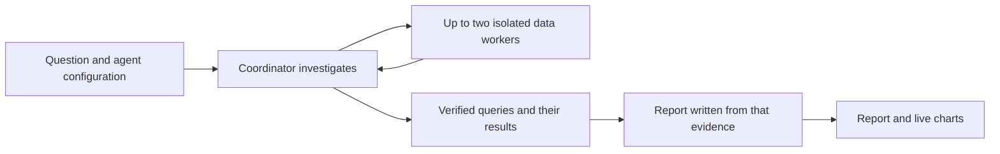

<Info>
  **Availability:** Deep research is a [Beta](/help/feature-maturity-levels) feature available wherever [AI agents](/agents/set-up-agents) are enabled, including eligible AI trials. Lightdash Cloud enables the feature flag by default. Self-hosted deployments need the same Enterprise Edition license and AI provider configuration required by AI agents, and must enable the `ai-deep-research` feature flag.
</Info>

Deep research is a long-running mode for Lightdash AI agents. It is designed for questions that need several queries, competing explanations, and a reusable report rather than one immediate answer.

The agent investigates in the background using its Lightdash context and configured sources. It returns a structured report with verified charts, evidence-led findings, and explicit caveats where the data limits the conclusion.

<Frame>
  
</Frame>

## When to use deep research

Choose deep research for multi-step investigations that need cross-checking, several data cuts, or a report you can save and revisit. Stay in the default Ask mode for a quick lookup, one chart, or an interactive conversation where you want to steer each follow-up.

Questions that work well include:

- *"Which product categories are trending down this quarter, and what is driving the change?"*
- *"Why did returning-customer revenue fall over the last 90 days? Test the main explanations."*
- *"Compare paid and organic acquisition quality across our top three regions."*

## How it works

Deep research uses the selected AI agent's configuration, including its instructions, semantic-layer access, knowledge documents, project and repository context, and enabled tools. It automatically inherits the organization's research limits and every MCP server attached to the agent; there is no per-run depth or source selection. Lightdash retries transient MCP discovery and provider timeouts with a bounded backoff. If an attached MCP server remains unavailable, the run preserves completed evidence and continues with healthy MCP servers and built-in tools where possible.

For each run, a coordinator owns the investigation: it gathers context, queries the data, and decides what to pursue next. When a question is genuinely separable it can hand that question to an isolated data worker, up to two per run. A worker sees only its own task and warehouse tools, and returns a compact findings packet rather than raw results.

The coordinator does not write the report. When research ends, Lightdash rebuilds what the run established from the queries it actually ran and their results, and the report is written from that evidence. This keeps the report grounded in verified executions and means a run that stops early still reports what it found.

Because the run executes on the server, you can close the tab or leave the thread. Reopening the thread restores the run card and its latest state.

## Start a run

<Steps>
  <Step title="Open Ask AI">
    Use the Ask AI composer on the homepage, start a new agent thread, or open an existing thread that you own. Deep research is unavailable in read-only threads, such as another user's thread or a thread started in Slack.
  </Step>
  <Step title="Enable Deep research">
    Select **Deep research** in a new conversation, or select the telescope icon in an existing conversation. The control changes color when the mode is active. For longer investigative questions, the telescope can pulse once to suggest this mode; you can still continue in regular chat.
  </Step>
  <Step title="Describe the outcome you need">
    Include the decision or question, relevant time period, important segments, and any definitions or constraints the agent should preserve.
  </Step>
  <Step title="Start the investigation">
    Submit the question. Lightdash saves it in the thread, creates a durable run, and begins processing it in the background.
  </Step>
</Steps>

## Organization-wide settings and limits

When AI agents and the `ai-deep-research` feature flag are enabled, organization admins can go to **Organization settings** → **Ask AI** → **Deep research** to configure the safety limits inherited by every run:

- **Maximum steps** — model steps the coordinator may take before it must finish
- **Maximum tool calls** — total tool calls across the coordinator and its workers
- **Maximum warehouse queries** — total semantic-layer and SQL queries across the run
- **Time limit (ms)** — wall-clock ceiling for the research phase
- **Maximum tokens** — total model tokens across the run
- **Allow raw SQL** — whether eligible users may use native or MCP `run_sql` tools during a run

Each numeric limit must be a positive whole number. Defaults are 16 steps, 24 tool calls, 15 warehouse queries, a 10-minute time limit, and 10 million model tokens. Raw SQL is disabled by default. Organization admins can change these values to match their governance and cost requirements.

Limits apply to the run as a whole, not to each worker separately. Well before a ceiling, a run stops widening its investigation and starts settling on an answer, so it usually finishes on its own rather than being cut off. When a run does reach a limit, Lightdash still writes the report from the evidence gathered up to that point and marks the run as partially completed. Lightdash blocks predictable unbounded field-value and dimension-only scans before warehouse execution and asks the agent to narrow them. A warehouse resource-limit error can trigger up to two attempts with a narrower or simpler query; Lightdash does not retry the unchanged query.

## Sources and permissions

Deep research can use:

- **Agent context and project data** — the semantic layer, saved Lightdash content, knowledge documents, and other context configured on the selected agent, subject to its [data access settings](/agents/data-access).
- **Warehouse queries** — semantic queries and, when the agent and user are allowed to use it, SQL.
- **Repository context** — project context and source-code tools configured on the agent.
- **MCP servers** — every [server attached to the agent](/agents/connect-external-mcp-servers) and its enabled tools.

<Warning>
  Deep research runs without pausing for approval on each warehouse query or MCP tool call. An attached MCP server can expose write actions, and its enabled actions can run unattended. Review the agent's attached servers and enabled tools before starting a run.
</Warning>

Deep research does not grant new permissions. The run starts with the creator's access and the selected agent's configuration, and Lightdash revalidates that access while the investigation runs. Revoking access or disconnecting a source can stop an active investigation or leave that source unavailable.

Raw SQL requires both **Allow raw SQL** in **Organization settings** → **Ask AI** → **Deep research** and the initiating user's existing SQL Runner permission. Turning the organization setting off leaves governed semantic and metric queries available, but removes native and MCP raw SQL tools from the run.

## Follow progress

The run card stays next to the question that started it and shows the latest phase, elapsed time, warehouse-query count, finding count, and recent activity.

<AccordionGroup>
  <Accordion title="Queued">
    Lightdash accepted the run and is waiting for a background worker to start it.
  </Accordion>
  <Accordion title="Running">
    The agent is gathering context, querying the data, or writing the report. Select **View activity** to inspect recent progress.
  </Accordion>
  <Accordion title="Completed">
    The full report is ready and saved in the thread.
  </Accordion>
  <Accordion title="Partially completed">
    The run reached a resource limit or recoverable error. Lightdash still wrote the report from the evidence gathered before it stopped. Select **Resume research** to continue unfinished work from the preserved evidence without rerunning successful queries.
  </Accordion>
  <Accordion title="Failed">
    The run could not produce a valid report. If it preserved usable evidence, select **Resume research** to continue unfinished work. Otherwise, the run card provides guidance to start over.
  </Accordion>
  <Accordion title="Cancelled">
    The creator stopped the run before it finished.
  </Accordion>
</AccordionGroup>

Select **Stop research** while a run is queued or running to request cancellation. Cancellation is asynchronous, so a running tool call may reach its next safe checkpoint before the status changes.

Only one deep research run can be active in a thread at a time. While it is active, the deep research control is disabled, but you can continue sending regular chat messages in the same thread. The control becomes available again when the run completes, partially completes, fails, or is cancelled.

## Read the report

Select **Open full report** from a completed or partially completed run card. Deep Research reports are marked **Beta** and include a contents rail on larger screens so you can jump between findings. A report contains:

<Frame>
  
</Frame>

- A short generated title and a direct introduction
- Finding sections led by verified charts, followed by concise supporting narrative
- A conclusion and inline caveats where data coverage, freshness, or the semantic layer limits the conclusion
- Citations for external evidence when the report uses it

Before publishing, Lightdash validates every chart reference in the report. If a reference is malformed, duplicated, missing, or cannot be verified, Lightdash removes that reference while preserving valid findings and narrative. The run activity and report warning identify adjusted or omitted content.

### Report charts

Warehouse-backed charts are read-only inside the report. They keep inspection interactions such as tooltips, legends, highlights, and useful zoom, but do not offer report-side drill, filter, edit, or save actions.

Every report chart is backed by one verified warehouse query the run actually executed. When you open or revisit a report, Lightdash runs that query through the normal async query path, so the chart shows current warehouse data rather than a persisted result snapshot. Select **Open in Explore** to continue investigating with the equivalent query, filters, fields, and visualization state in a new tab.

### Report retention

Deep research report content and report-chart access expire **30 days after the run completes**. The run's question, status, and completion date remain in the thread. After expiry, select **Run again** to start a new investigation from the original question using the agent's current configuration and the organization's current limits.

The regular chat agent can use the status and report from deep research runs in the same conversation when answering follow-up questions. Ask it to clarify a finding, compare evidence, or explain a limitation without pasting the report back into the chat.

## Get better reports

- State the decision you are trying to make, not only the metric you want to inspect.
- Define ambiguous terms such as *active customer*, *conversion*, or *retention*.
- Include the time range and comparison period.
- Name segments the agent must test, such as channel, region, plan, or product category.
- Ask it to test alternatives or contradictions instead of assuming one cause.
- Treat a partially completed report as a starting point. Resolve unavailable sources or tighten the question before running it again; ask an organization admin to review the limits if runs repeatedly exhaust them.

## Access requirements

Your organization must have the AI Agents entitlement or an eligible trial, the `ai-deep-research` feature flag enabled, and **Enable AI features for users** turned on in **Organization settings** → **Ask AI** → **General**. Self-hosted deployments must also configure an AI provider as described in the [AI Analyst environment variables](/self-host/customize-deployment/environment-variables#ai-analyst).

Deep research is enabled by default on Lightdash Cloud. Self-hosted deployments must enable the `ai-deep-research` feature flag.

Starting a run requires the Enterprise **Start Deep Research runs** scope (`create:AiDeepResearch`) for the project. Developer and Admin roles receive this scope by default. Add it explicitly to any [custom role](/workspace-admin/custom-roles) that should be allowed to start runs.

Users can only read, retry, or cancel their own deep research runs, and only within threads they are allowed to access.

## Frequently asked questions

**Do I have to keep the tab open?**

No. The run continues on the server and its state is saved in the thread.

**Can I start deep research in an existing conversation?**

Yes. You can start a run from an existing thread you own as long as the thread is not read-only and the agent's model is still available.

**Can I start another run while research is still active?**

Not in the same thread. You can keep chatting normally, or start deep research in another eligible thread. The control returns when the current run reaches a terminal state.

**Why did my run partially complete?**

The agent reached a resource budget or encountered a recoverable failure. Because the report is written from the queries the run executed rather than assembled as it goes, Lightdash still reports what the run established instead of discarding it.

**What happens when a warehouse query exceeds a resource limit?**

Lightdash asks the agent to narrow or simplify the query and allows up to two changed-query recovery attempts. If recovery is exhausted, the affected evidence is omitted and the report can still complete with a caveat when the remaining evidence is useful.

**What does “No relevant data” mean?**

The investigation completed cleanly but found no evidence relevant to the question. Refine the question or choose a project and data source that cover the topic; starting the same request again does not add new evidence.

**Does retrying a failed run reuse its queries?**

When a partially completed or failed run has usable evidence, **Resume research** creates a new run that reuses its completed queries, findings, and charts, then continues the unfinished work. If no usable evidence was preserved, **Start over** creates a new run from the original question.

**Does deep research only read data?**

No. It uses the selected agent's configured tools. Warehouse queries run without individual approval, and attached MCP servers may include write actions. Review the agent's configuration before starting.

**Can I continue chatting after the report is ready?**

Yes. The report remains available in the thread for 30 days, and the same agent can use it as context for follow-up questions.
