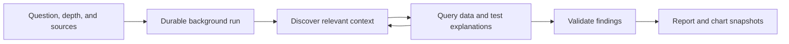

<Info>
  **Availability:** Deep research is a [Beta](/references/workspace/feature-maturity-levels) feature available on **Enterprise** plans. It is behind a feature flag. [Contact Lightdash](mailto:support@lightdash.com) to enable it for your organization.
</Info>

Deep research is a long-running mode for Lightdash AI agents. It is designed for questions that need several queries, competing explanations, and a reusable report rather than one immediate answer.

The agent investigates in the background using its Lightdash context and the sources you approve. It returns a structured Markdown report with confidence levels, supporting charts, citations for external sources, and explicit caveats.

<Frame>
  
</Frame>

## When to use deep research

<CardGroup cols={2}>
  <Card title="Use deep research" icon="telescope">
    Choose this mode for multi-step investigations that need cross-checking, several data cuts, or a report you can share and revisit.
  </Card>
  <Card title="Use Ask mode" icon="comment">
    Stay in the default mode for a quick lookup, one chart, or an interactive conversation where you want to steer each follow-up.
  </Card>
</CardGroup>

Questions that work well include:

- *"Which product categories are trending down this quarter, and what is driving the change?"*
- *"Why did returning-customer revenue fall over the last 90 days? Test the main explanations."*
- *"Compare paid and organic acquisition quality across our top three regions."*

## How it works

Deep research uses the selected AI agent's configuration, including its instructions, semantic-layer access, knowledge documents, project and repository context, and enabled tools. It records progress as it works and saves the final report in the originating thread.

Because the run executes on the server, you can close the tab or leave the thread. Reopening the thread restores the run card and its latest state.

## Start a run

<Steps>
  <Step title="Open an AI agent thread">
    Start a new thread or open an existing thread that you own. Deep research is unavailable in read-only threads, such as another user's thread or a thread started in Slack.
  </Step>
  <Step title="Select Deep research">
    Click **Deep research (Beta)** in the composer. The research settings appear above the message input.
  </Step>
  <Step title="Choose a research depth">
    Select **Low**, **Medium**, **High**, or **Extra High**. Medium is the default.
  </Step>
  <Step title="Review MCP sources">
    Choose which MCP servers attached to the agent can participate in this run. All available attached servers are selected by default.
  </Step>
  <Step title="Describe the outcome you need">
    Include the decision or question, relevant time period, important segments, and any definitions or constraints the agent should preserve.
  </Step>
  <Step title="Start the investigation">
    Submit the question. Lightdash saves it in the thread, creates a durable run, and begins processing it in the background.
  </Step>
</Steps>

## Research depth

Depth controls the run's resource budget, including model tokens, tool calls, warehouse queries, and result rows. It is not a fixed duration: warehouse latency does not use up the reasoning budget.

<CardGroup cols={2}>
  <Card title="Low" icon="gauge-low">
    Up to **10 warehouse queries**. Best for a focused check of the strongest available evidence.
  </Card>
  <Card title="Medium" icon="gauge">
    Up to **25 warehouse queries**. Best for a balanced investigation with validation and alternatives.
  </Card>
  <Card title="High" icon="gauge-high">
    Up to **50 warehouse queries**. Best for a broad investigation with more competing explanations.
  </Card>
  <Card title="Extra High" icon="chart-simple">
    Up to **100 warehouse queries**. Best for the widest evidence review on high-stakes questions.
  </Card>
</CardGroup>

Start with the smallest depth likely to answer your question. A larger depth gives the agent more opportunities to explore and validate, but it does not guarantee a better answer when the semantic layer or source data is incomplete.

## Sources and permissions

Deep research can use:

- **Agent context and project data** — the semantic layer, saved Lightdash content, knowledge documents, and other context configured on the selected agent, subject to its [data access settings](/guides/ai-agents/data-access).
- **Warehouse queries** — semantic queries and, when the agent and user are allowed to use it, SQL.
- **Repository context** — project context and source-code tools configured on the agent.
- **MCP servers** — only the [agent-attached servers](/guides/ai-agents/mcp-servers) selected in the research settings.

<Warning>
  Deep research runs without pausing for approval on each warehouse query or MCP tool call. An enabled MCP server can expose write actions, and those actions can run unattended. Select only servers whose enabled tools you want the agent to use for this investigation.
</Warning>

Deep research does not grant new permissions. The run starts with the creator's access and the selected agent's configuration, and Lightdash revalidates that access while the investigation runs. Revoking access can stop an active run.

## Follow progress

The run card stays in the thread and shows the latest phase, elapsed time, warehouse-query count, finding count, and recent activity.

<AccordionGroup>
  <Accordion title="Queued">
    Lightdash accepted the run and is waiting for a background worker to start it.
  </Accordion>
  <Accordion title="Running">
    The agent is gathering context, testing explanations, validating findings, or writing the report. Select **View activity** to inspect recent progress.
  </Accordion>
  <Accordion title="Completed">
    The full report is ready and saved in the thread.
  </Accordion>
  <Accordion title="Partially completed">
    The run reached a resource limit or recoverable error, but Lightdash preserved a usable report and its validated evidence.
  </Accordion>
  <Accordion title="Failed">
    The run could not produce a valid report. The run card keeps completed activity and provides safe retry guidance.
  </Accordion>
  <Accordion title="Cancelled">
    The creator stopped the run before it finished.
  </Accordion>
</AccordionGroup>

Select **Stop research** while a run is queued or running to request cancellation. Cancellation is asynchronous, so a running tool call may reach its next safe checkpoint before the status changes.

## Read the report

Select **Open full report** from a completed or partially completed run card. A report contains:

<Frame>
  
</Frame>

- A direct introduction that answers the question and states overall confidence
- Two to five connected finding sections, each with a **low**, **medium**, or **high** confidence level
- Charts when visual evidence improves the explanation
- Caveats where data coverage, freshness, or the semantic layer limits the conclusion
- A conclusion and citations for external evidence

<Note>
  Confidence reflects the evidence available to the agent, not a guarantee that the conclusion is correct. Review the definitions, assumptions, and supporting queries before making a high-impact decision.
</Note>

### Chart snapshots and live data

Warehouse-backed charts open on a snapshot of the data the agent used when it wrote the report. This preserves the original evidence even if the underlying data changes later.

Select **Live data** on a warehouse-backed chart to rerun its stored query and compare the latest result with the snapshot. Charts computed by the agent from derived or external data have no single warehouse query and cannot be refreshed.

## Get better reports

- State the decision you are trying to make, not only the metric you want to inspect.
- Define ambiguous terms such as *active customer*, *conversion*, or *retention*.
- Include the time range and comparison period.
- Name segments the agent must test, such as channel, region, plan, or product category.
- Ask it to test alternatives or contradictions instead of assuming one cause.
- Treat a partially completed report as a starting point and rerun at a larger depth only when the missing evidence matters.

## Access requirements

Starting a run requires the Enterprise **Start Deep Research runs** scope (`create:AiDeepResearch`) for the project. Developer and Admin roles receive this scope by default. Add it explicitly to any [custom role](/references/workspace/custom-roles) that should be allowed to start runs.

Users can only read, retry, or cancel their own deep research runs, and only within threads they are allowed to access.

## Frequently asked questions

**Do I have to keep the tab open?**

No. The run continues on the server and its state is saved in the thread.

**Can I start deep research in an existing conversation?**

Yes. You can start a run from an existing thread you own as long as the thread is not read-only and the agent's model is still available.

**Why did my run partially complete?**

The agent reached a resource budget or encountered a recoverable failure after producing a valid draft. Lightdash preserves the supported findings rather than discarding the report.

**Does deep research only read data?**

No. It uses the selected agent's configured tools. Warehouse queries run without individual approval, and selected MCP servers may include write actions. Review the source selection before starting.

**Can I continue chatting after the report is ready?**

Yes. The report remains attached to the thread, and you can continue the conversation with the same agent.
