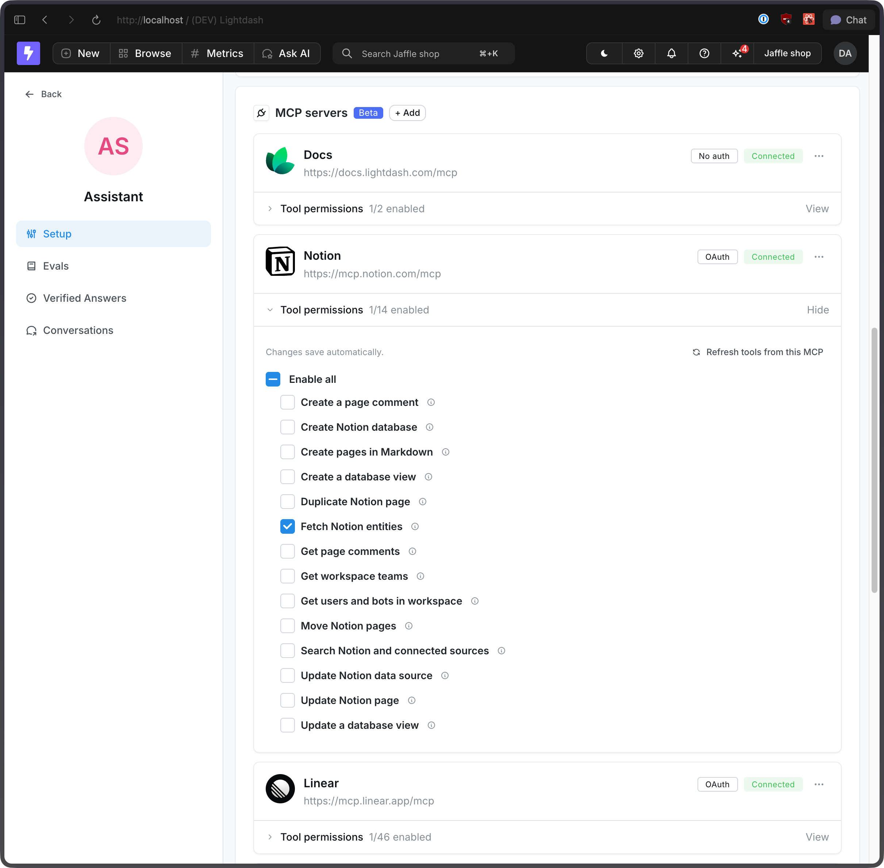

Choosing the right MCP servers is only half the job. Each connected server exposes a set of tools, and every enabled tool becomes part of the agent's working context on every turn.

That means tool curation matters for both safety and quality:

- Enable only the actions that match the agent's job.
- Prefer read-only access unless the agent truly needs to create or update something.
- Keep the tool list small so the model has more room for instructions, conversation context, and reasoning.

<Frame>
  
</Frame>

## Choose which tools are exposed

Open an MCP server in your project settings and expand **Tool permissions** to decide which tools the agent can use.

A few good defaults:

- **Start read-only.** Enable tools like `search`, `fetch`, or `get` first, and leave create, update, move, or delete operations off until they're clearly needed.
- **Match tools to the workflow.** A support agent might need to read Notion pages and search docs, but not move pages or update databases.
- **Add write access intentionally.** If an agent files Linear issues or updates external systems, enable just those specific write tools instead of the full set.

## Why curation improves results

Every enabled tool adds names, descriptions, and parameter schemas to the prompt. When the agent has too many tools, it has more to sift through before it can answer a question or take an action.

Curated toolsets help agents:

- pick the right action faster
- avoid irrelevant or risky tools
- stay focused on the narrow job they were designed to do

## Recommended approach

1. Start with one MCP server and the smallest useful tool set.
2. Test the agent on real tasks.
3. Add tools only when you see a clear gap.
4. Split broad responsibilities across multiple specialized agents instead of one agent with every MCP attached.

## Related

- [Connecting MCP servers](/guides/ai-agents/mcp-servers)
- [Lightdash MCP server](/references/integrations/lightdash-mcp)
