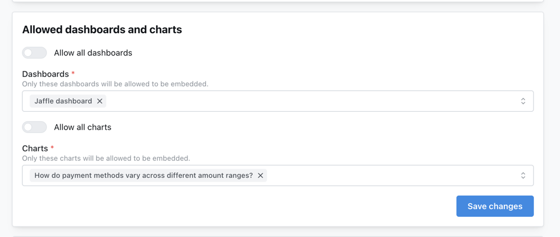

import EmbedAvailability from '/snippets/embedding-availability.mdx';

<EmbedAvailability />

## Overview

Chart embedding displays a single saved chart with a minimal, focused interface — a clean, distraction-free view of one visualization, scoped to that chart alone.

<Warning>
Chart embedding is **only available through the React SDK**. iframe embedding is not supported for charts. Chart embeds are also **read-only**: viewers can't change the configuration, apply filters, or reach Explore.
</Warning>

### When to use chart embedding

- **Single KPI displays**: show one key metric or visualization
- **Embedded widgets**: add analytics widgets to application pages
- **Minimal UI**: a clean, focused display with no dashboard chrome
- **Scoped access**: grant access to specific charts, not entire dashboards

### How it differs from dashboard embedding

| Feature | Dashboard embedding | Chart embedding |
|---|---|---|
| **Method** | iframe or React SDK | React SDK only |
| **Content** | Multiple tiles, tabs | Single chart |
| **Filters** | Interactive dashboard filters | Saved filters only, not interactive |
| **JWT scope** | Dashboard UUID | Chart UUID (`contentId`) |
| **Explore** | Can navigate to Explore | No Explore access |

Chart embeds support all chart types (bar, line, pie, table, big number, and so on), parameterized charts with their saved values, and — when enabled in the JWT — CSV export, image export, and viewing underlying data.

## Set up a chart embed

Follow the [embedding quickstart](/embed/set-up-embedding) for the shared setup: create an embed secret and generate tokens from your backend. The chart-specific part is the allowlist — each chart must be added individually under **Settings → Embed** before it can be embedded.

<Frame>
  
</Frame>

## Embed with the React SDK

Render a chart with `Lightdash.Chart`, passing the chart UUID and a server-generated token:

```tsx
import Lightdash from '@lightdash/sdk';

function MyChart() {
  return (
    <Lightdash.Chart
      instanceUrl="https://app.lightdash.cloud"
      id="your-chart-uuid"
      token={generateToken()} // Server-side function
    />
  );
}
```

See the [React SDK reference](/embed/react-sdk#lightdashchart) for installation, CORS setup, props, and styling.

## Configure what viewers can do

A chart token is scoped to one chart via `content.contentId` (the saved chart UUID). Inside `content`, you can allow CSV export, image export, and viewing underlying data. For the full schema, see the [chart token](/embed/reference#chart-token) in the embedding reference.

```javascript
import jwt from 'jsonwebtoken';

const token = jwt.sign({
  content: {
    type: 'chart',
    projectUuid: 'your-project-uuid',
    contentId: 'your-chart-uuid',

    canExportCsv: true,
    canExportImages: true,
    canViewUnderlyingData: true,
  },
  user: {
    externalId: 'user-123',
    email: 'user@example.com',
  },
}, LIGHTDASH_EMBED_SECRET, { expiresIn: '24h' });
```

<Info>
Parameter values are fixed when the chart is saved. A chart embed displays the chart with its saved parameter configuration.
</Info>

## Limitations

Chart embeds are always read-only and single-scope. Compared to dashboard embeds, viewers **cannot** modify dimensions, metrics, or visualization type; add or change filters (including via the SDK `filters` prop); reach the Explore view or underlying data model; or access any content beyond the chart named in `contentId`.

<Info>
If you need interactive filters or exploration, use [dashboard embedding](/embed/embed-dashboards) instead, or reach out with your use case.
</Info>

## Example: single KPI widget

Drop a key metric into your own layout and let the chart background go transparent so it inherits your styling:

```tsx
<div className="kpi-widget">
  <h3>Monthly Revenue</h3>
  <Lightdash.Chart
    instanceUrl="https://app.lightdash.cloud"
    id="revenue-chart-uuid"
    token={token}
    styles={{ backgroundColor: 'transparent' }}
  />
</div>
```

Pass `user` metadata in the token to attribute queries in [usage analytics](/workspace-admin/usage-analytics#query-tags), and `userAttributes` for row-level security. Styling and localization props are covered in the [React SDK reference](/embed/react-sdk#lightdashchart).

## Next steps

<CardGroup cols={2}>
  <Card title="Embedding reference" icon="book" href="/embed/reference#chart-token">
    Complete chart JWT structure and options
  </Card>

  <Card title="React SDK reference" icon="react" href="/embed/react-sdk#lightdashchart">
    Props, styling, and localization for the Chart component
  </Card>

  <Card title="Embedding dashboards" icon="grid-2" href="/embed/embed-dashboards">
    Embed multiple charts with filters and interactivity
  </Card>

  <Card title="User attributes & row-level security" icon="shield-check" href="/workspace-admin/user-attributes">
    Show different data to different users
  </Card>
</CardGroup>
