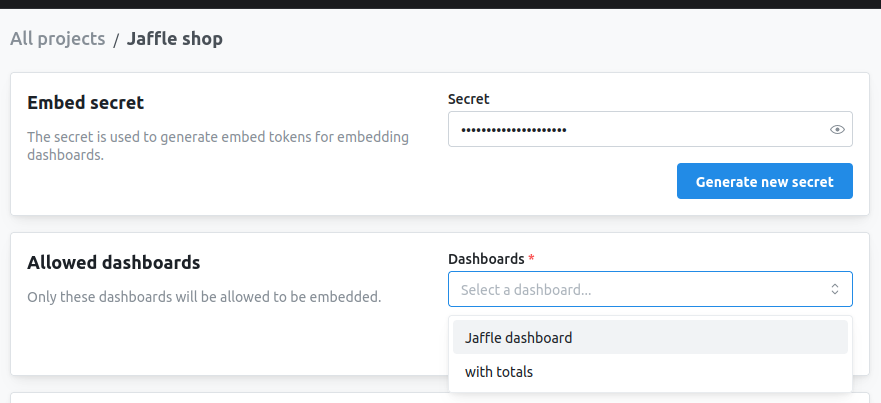

import EmbedAvailability from '/snippets/embedding-availability.mdx';
import EmbedResources from '/snippets/embedding-resources.mdx';

<EmbedAvailability />

<EmbedResources />

## Overview

Dashboard embedding displays a full Lightdash dashboard in your application — multiple visualizations, filters, tabs, and interactive features — so you can give users comprehensive analytics views without a Lightdash login. It's the only surface you can embed with a plain iframe; everything else needs the [React SDK](/embed/react-sdk).

### When to use dashboard embedding

- **Executive dashboards**: multiple KPIs and metrics in admin panels
- **Customer-facing analytics**: analytics portals for SaaS customers
- **Embedded reporting**: comprehensive data views inside your workflows
- **Multi-chart views**: related visualizations with shared filters

### What you can put on an embedded dashboard

An embedded dashboard renders the same tiles it does in Lightdash: saved charts, SQL Runner charts, [data app](/data-apps) tiles, and markdown, Loom, and heading tiles, organized across multiple tabs.

<Note>
SQL Runner chart tiles are authorized through dashboard-tile membership, so they render with existing embed JWTs — you don't need to regenerate tokens or change embed URLs. A SQL chart is only embeddable as part of a dashboard; a chart-scoped JWT (`type: 'chart'`) can't embed one on its own.
</Note>

## Set up a dashboard embed

Embedding always starts with the shared setup: create an embed secret, add your dashboard to the allowlist, preview it, and generate tokens from your backend. Follow the [embedding quickstart](/embed/set-up-embedding) for those steps.

The only dashboard-specific part of setup is the allowlist: only dashboards added to the **allowed dashboards** list can be embedded. Add yours under **Settings → Embed**, or toggle **Allow all dashboards** to embed any dashboard in the project.

<Frame>
  
</Frame>

## Configure what viewers can do

Everything a viewer can do on an embedded dashboard is controlled by fields nested inside the JWT `content` object: interactive dashboard filters (including letting viewers add their own), parameters, CSV/image/PDF exports, date zoom, "Explore from here", viewing underlying data, and rendering data app tiles. Adding a `writeActions` claim also lets viewers save charts from Explore or edit and build dashboards through the SDK.

<Warning>
Interactivity options like `dashboardFiltersInteractivity`, `canExportCsv`, and `canExplore` must live **inside `content`**, not at the top level of the payload. At the root level they're silently ignored.
</Warning>

For the full list of options, their accepted values, and per-option UI screenshots, see the [dashboard token](/embed/reference#dashboard-token) and [interactivity options](/embed/reference#interactivity-options-reference) in the embedding reference. A token that exercises the common ones looks like this:

```javascript
import jwt from 'jsonwebtoken';

const token = jwt.sign({
  content: {
    type: 'dashboard',
    projectUuid: 'your-project-uuid',
    dashboardUuid: 'your-dashboard-uuid',

    // Filters and parameters
    dashboardFiltersInteractivity: { enabled: 'all' },
    parameterInteractivity: { enabled: true },

    // Exports
    canExportCsv: true,
    canExportImages: true,
    canExportPagePdf: true,

    // Interactive features
    canDateZoom: true,
    canExplore: true,
    canViewUnderlyingData: true,
    canViewDataApps: true,
  },

  // Analytics (optional)
  user: {
    externalId: 'user-123',
    email: 'user@example.com',
  },

  // Row-level filtering (optional)
  userAttributes: {
    tenant_id: 'tenant-abc',
  },
}, LIGHTDASH_EMBED_SECRET, { expiresIn: '1h' });
```

<Info>
**Required filters behave the same as in the app.** Embedded dashboards honor [required filters and requirement groups](/explore/dashboards/filter#required-filters-and-filter-requirement-groups): tiles stay locked and don't load data while any rule is unmet, and viewers see the guided setup card. Style it with the [`ld-dashboard-guided-setup`](/embed/react-sdk#css-class-overrides) class.
</Info>

### Let viewers save and edit content

Add a `writeActions` claim to let embedded users save a new chart from Explore, or — through the React SDK — edit an existing dashboard or build a new one. Lightdash performs the write as a configured actor (a service account or user) into a fixed destination space. See [Write actions](/embed/reference#write-actions) for the claim and [`Lightdash.Dashboard` edit mode](/embed/react-sdk#with-edit-mode) for the SDK flow.

<Info>
Newly saved charts aren't added to the embed allowlist, so they won't be re-embeddable unless you add them explicitly.
</Info>

### View data apps

[Data app](/data-apps) tiles run their own metric queries, so they only render when the JWT sets `canViewDataApps: true`. When it's off (the default), the tile shows a placeholder and no queries run. When on, the data app inherits the embed's [user attributes](/workspace-admin/user-attributes) and filters, so row-level access still applies — only enable it for audiences you trust with the data the app can query. For standalone data app embedding (no dashboard), see [How to embed data apps](/embed/embed-data-apps).

## Embed with an iframe

iframe embedding needs no libraries or CORS. Pass the project UUID in the path and the JWT in the hash fragment; the dashboard is identified by `content.dashboardUuid` inside the token, not the URL:

```
https://your-instance.lightdash.cloud/embed/{projectUuid}#{jwtToken}
```

```html
<iframe
  src="https://app.lightdash.cloud/embed/project-uuid#jwt-token"
  width="100%"
  height="600"
  frameborder="0"
  style="border: none;"
></iframe>
```

The [iframe embedding reference](/embed/iframe) covers URL parameters (including `theme`, `backgroundColor`, and `timezone`), responsive and dynamic sizing, token refresh, and troubleshooting.

## Embed with the React SDK

The React SDK renders the dashboard as a component and adds programmatic filters, callbacks, custom styling, and edit mode.

```tsx
import Lightdash from '@lightdash/sdk';

function MyDashboard() {
  return (
    <Lightdash.Dashboard
      instanceUrl="https://app.lightdash.cloud"
      token={tokenFromServer}
    />
  );
}
```

See the [React SDK reference](/embed/react-sdk#lightdashdashboard) for installation, CORS setup, props, filters, theming, and localization.
