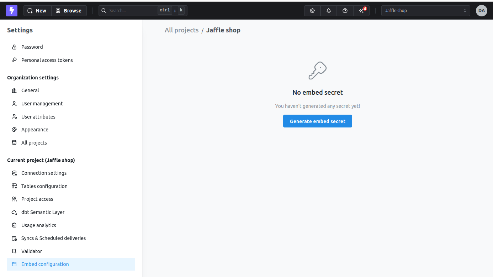
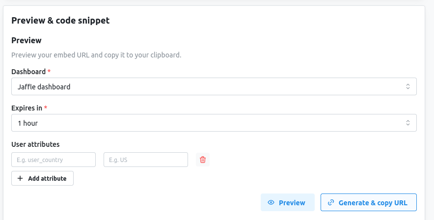
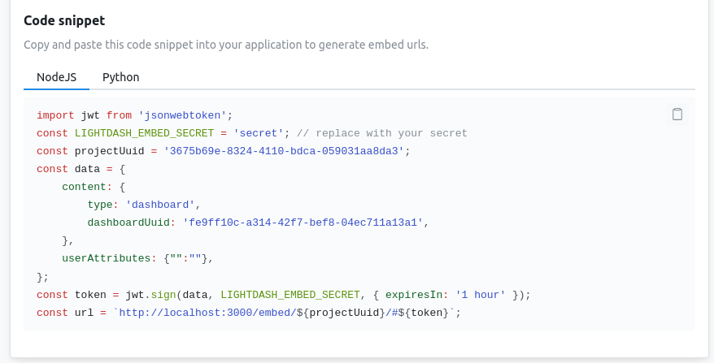

import EmbedAvailability from '/snippets/embedding-availability.mdx';

<EmbedAvailability />

## What can you embed?

Lightdash supports embedding several types of content, each designed for different use cases:

### Dashboards

Embed complete dashboards with multiple visualizations, filters, and tabs. Perfect for providing comprehensive analytics views in your application.

**Use cases:**
- Executive dashboards in admin panels
- Customer-facing analytics portals
- Embedded reporting for SaaS applications

[Learn more about embedding dashboards →](/embed/embed-dashboards)

### Charts

Embed individual saved charts for focused, single-metric displays. Charts provide a minimal UI for clean integration.

**Use cases:**
- Single KPI widgets in applications
- Embedded metrics in marketing pages
- Focused analytics in workflows

<Info>
Chart embedding requires the React SDK. iframe embedding is only available for dashboards.
</Info>

[Learn more about embedding charts →](/embed/embed-charts)

### AI agents

Embed a Lightdash AI agent so customers can chat with their data and generate charts without leaving your product. Each embed is scoped to a single agent and space.

**Use cases:**
- "Chat with your data" experiences inside customer-facing apps
- Self-serve analytics where customers can ask ad-hoc questions
- Scoped AI access where each customer can only see their own content

<Info>
AI agent embedding requires the React SDK. iframe embedding is not supported for AI agents.
</Info>

[Learn more about embedding AI agents →](/embed/embed-ai-agents)

### Metrics catalog

Embed the project's metrics catalog so users can browse the metrics and dimensions in your semantic layer, preview them, and — if you allow it — jump into Explore from any metric. Great for surfacing "what can I measure?" inside your product without exposing a full Lightdash workspace.

**Use cases:**
- A self-serve metric browser inside a customer-facing app
- A discovery surface next to your own charts so users can find related metrics
- Guided exploration where users start from a metric and continue into Explore

<Info>
Metrics catalog embedding requires the React SDK. iframe embedding is not supported for the metrics catalog.
</Info>

[Learn more about embedding the metrics catalog →](/embed/embed-metrics-catalog)

### Data apps

Embed a [data app](/data-apps) as standalone content in an iframe — the full app, no dashboard or surrounding chrome. Useful when you want to surface an entire AI-generated app as a feature in your product.

**Use cases:**
- Customer-facing interactive reports
- Embedded narratives or slide-show apps in your product
- Self-serve analytics views built on your semantic layer

[Learn more about embedding data apps →](/embed/embed-data-apps)

## How can you share or embed content?

Lightdash offers three ways to share embedded content. The choice depends on whether you need to embed content in your own application or simply share a link.

**Shareable URL** is the simplest option. Lightdash can generate a standalone URL that anyone can open directly in their browser — no iframe, no SDK, and no Lightdash account required. This is useful when you want to share a dashboard with users outside your organisation (e.g., clients, partners, or stakeholders) without embedding it in an application. The URL uses the same JWT-based security as the other methods, so it expires after the time you set and can include user attributes for row-level filtering.

**[iframe embedding](/embed/iframe)** lets you embed a dashboard inside your own web page. You generate a JWT, construct a URL, and add it to an `<iframe>` tag. There are no additional setup requirements and this works anywhere (React, Vue, plain HTML). Note that iframe embedding currently only supports dashboards (chart embedding via iframe is not supported).

**[React SDK](/embed/react-sdk)** (`@lightdash/sdk`) is the most powerful option. It supports both dashboards and charts, lets you pass filters programmatically, hook into user interaction callbacks (like when someone navigates to Explore), and apply custom styling to match your app. It requires a React/Next.js app and CORS configuration on the Lightdash instance (Cloud customers need to contact Lightdash to set that up).

All three methods use the same JWT-based authentication and security model.

### Quick comparison

| Feature | Shareable URL | iframe | React SDK |
|---|---|---|---|
| Dashboards | ✓ | ✓ | ✓ |
| Individual charts | ✗ | ✗ | ✓ |
| AI agents | ✗ | ✗ | ✓ |
| Metrics catalog | ✗ | ✗ | ✓ |
| Data apps (standalone) | ✓ | ✓ | ✗ |
| Requires embedding in an app | No | Yes | Yes |
| Setup complexity | Low | Low | Medium |
| CORS needed | No | No | Yes |
| Programmatic filters | Via JWT config | Via JWT config | Via SDK `filters` prop |
| Custom styling | No | Limited | Full control |
| Framework requirement | None | None | React / Next.js |

### Passing filters to embedded dashboards

Both methods support filters, just differently:

- **JWT config** — Set filters in the token payload at embed time. Works for both methods.
- **React SDK `filters` prop** — Pass them dynamically at runtime. Better if filters need to change based on the logged-in user.

## CORS

CORS controls which browser origins can call the Lightdash API. You only need to configure it when your embedded application calls Lightdash from the browser — that is, when using the [React SDK](/embed/react-sdk). Shareable URLs and iframe embeds do not need CORS. See [Set up CORS](/embed/react-sdk#set-up-cors) for how to add your origins.

## Quick start: Embed a dashboard

This quick start will walk you through embedding your first dashboard using an iframe.

### Step 1: Create an embed secret

First, you need to generate a secret per project. This secret is like a password that will help you encrypt the URLs so we know the access is valid.

<Frame>
  
</Frame>

You can regenerate the secret by clicking on the `Generate new secret` button. If you do this, people with an old URL will automatically lose access to any previously shared embed URL.

### Step 2: Add allowed dashboards

Only selected dashboards can be accessed via embed URLs. Add the dashboard you want to embed to the allowed list.

<Frame>
  
</Frame>

### Step 3: Configure and preview

Under the "Configure" section, you can:
- Select which dashboard to embed
- Set token expiration time
- Configure interactivity (filters, exports, etc.)
- Add user attributes for row-level security

<Frame>
  
</Frame>

Click on `Preview` to see how the embedded content will look, and click on `Generate & copy URL` to get a one-off embed URL for testing.

<Tip>
The generated URL can be shared directly with anyone — they can open it in their browser without needing a Lightdash account or any embedding setup. This is a quick way to share a dashboard with people outside your organisation (e.g., clients or partners) without building an iframe or React integration.
</Tip>

### Step 4: Generate tokens programmatically

Although you can generate URLs directly from Lightdash with a long expiration, it is recommended to generate your own JWTs in your backend with a short expiration using your `secret` to make sure people can't be using embed URLs outside your app.

Lightdash provides code snippets you can copy and use in your app to generate valid embed URLs, and the [embedding reference](/embed/reference) documents the full JWT structure:

<Frame>
  
</Frame>

## Common questions

### Do I need a Lightdash account to view embedded content?

No, embedded Lightdash content is available to view by anyone (not just folks with a Lightdash login).

So, for example, you could embed a dashboard in your product, and anyone who has access to your product would have access to that dashboard. No need to login to Lightdash. You can also share a dashboard URL directly with someone outside your organisation — they just open the link in their browser.

We make sure that the links are secure and have a set expiry time that you pick.

### How does security work?

Embedded content is secured using JWT (JSON Web Tokens) that you sign with your embed secret. The token includes:

- What content to display (dashboard or chart)
- Expiration time
- User attributes for row-level filtering
- Permissions for interactivity (filters, exports, etc.)

Tokens are short-lived and should be generated server-side to prevent exposure of your embed secret.

### Can I show different data to different users?

Yes! You can use [user attributes](/workspace-admin/user-attributes) to implement row-level security in your embedded content. This allows you to filter data based on the viewing user's properties (e.g., tenant ID, region, etc.).
