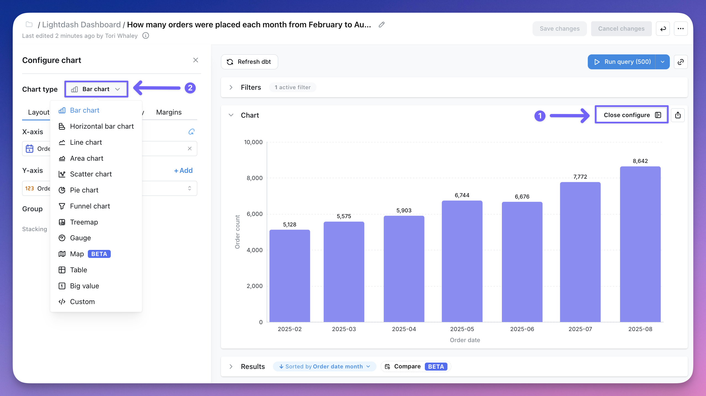

In Lightdash, the data in your results tables can be visualized in a bunch of different ways:

- [Bar chart](/explore/chart-types/bar-chart)
- [Horizontal bar chart](/explore/chart-types/bar-chart)
- [Line chart](/explore/chart-types/line-chart)
- [Area chart](/explore/chart-types/area-chart)
- [Mixed chart](/explore/chart-types/mixed-chart)
- [Scatter chart](/explore/chart-types/scatter-chart)
- [Pie chart](/explore/chart-types/pie-chart)
- [Funnel chart](/explore/chart-types/funnel-chart)
- [Treemap chart](/explore/chart-types/treemap-chart)
- [Sankey chart](/explore/chart-types/sankey)
- [Table](/explore/chart-types/table)
- [Big value](/explore/chart-types/big-value)
- [Gauge](/explore/chart-types/gauge)
- [Map](/explore/chart-types/map)
- [Custom Vega charts](/explore/chart-types/custom-vega-charts)
- [Custom app-based charts](/explore/chart-types/custom-app-based-charts)

**Custom** is one entry in the chart type menu covering two kinds of chart. A [Vega chart](/explore/chart-types/custom-vega-charts) is a one-off spec written in a JSON editor and belongs to that chart alone. An [app-based chart type](/explore/chart-types/custom-app-based-charts) is reusable: you describe the chart you want, Lightdash builds it, and anyone in the project can then apply it like a built-in chart type.

The visualization type that you pick determines how Lightdash shows the data series in your chart. To change how your data is displayed, click **Configure** when you're querying from a table. You have the option to change the chart type in the drop-down:

<Frame>
  
</Frame>
