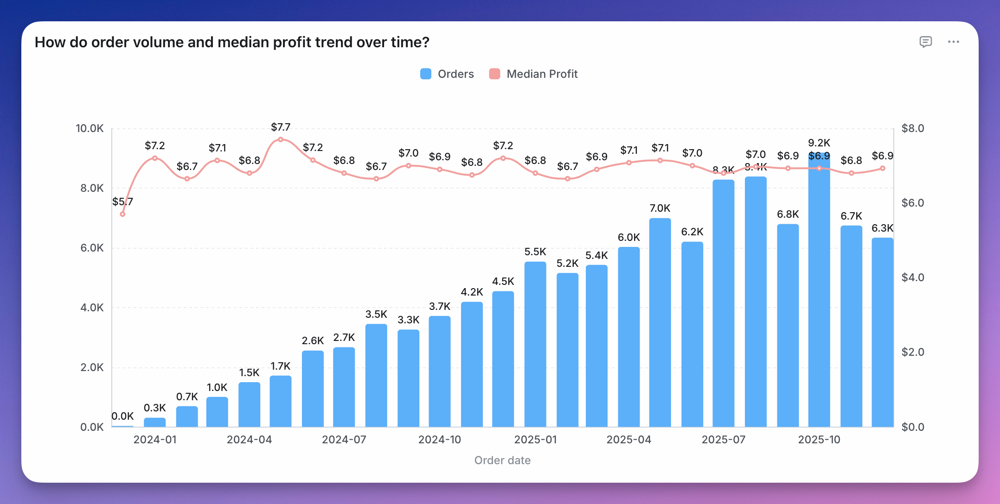
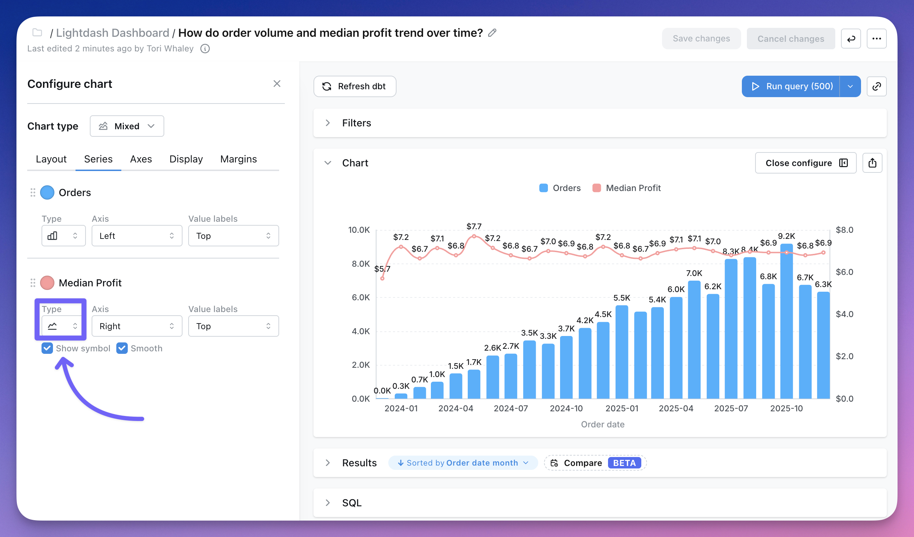

<Frame>
  
</Frame>

You can combine bars, line, and scatter charts on the same chart using a Mixed chart.

To use a Mixed chart, you'll need to start with either a line, scatter or horizontal bar chart type and have two or more series on your chart. Either from having two or more fields selected for your y-axis or from having a group with two or more groups.

Once you have the series you want on your chart, you can pick and choose the different chart types you'd like for each series in the `series` tab of the `Configure` space.

<Frame>
  
</Frame>

You can see more details about mixed chart configurations [here](/explore/configure-charts).
