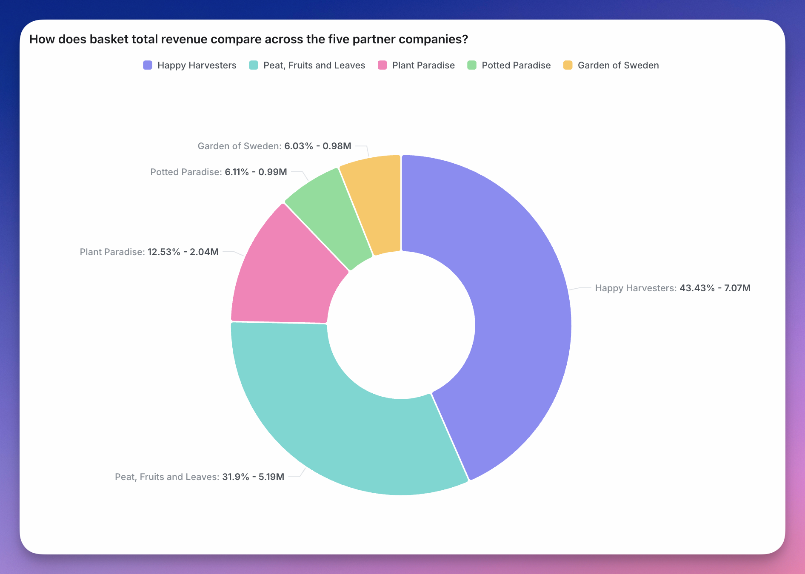

import GranularityPlaceholder from '/snippets/granularity-placeholder.mdx';

<Frame>
  
</Frame>

Pie charts can be useful to visualize data that adds up to a meaningful "whole". For example, the split of total revenue across each of our product lines.

To use a pie chart, you need at least one metric and one dimension in your query results. You can add multiple dimensions to create more granular groups in your pie charts.

By default, pie charts are shown in a donut shape (i.e. with the center removed) but you can easily toggle the `donut` toggle to switch between a traditional pie and donut chart.

## Referencing the active granularity in labels

<GranularityPlaceholder />

<Frame>
  
</Frame>