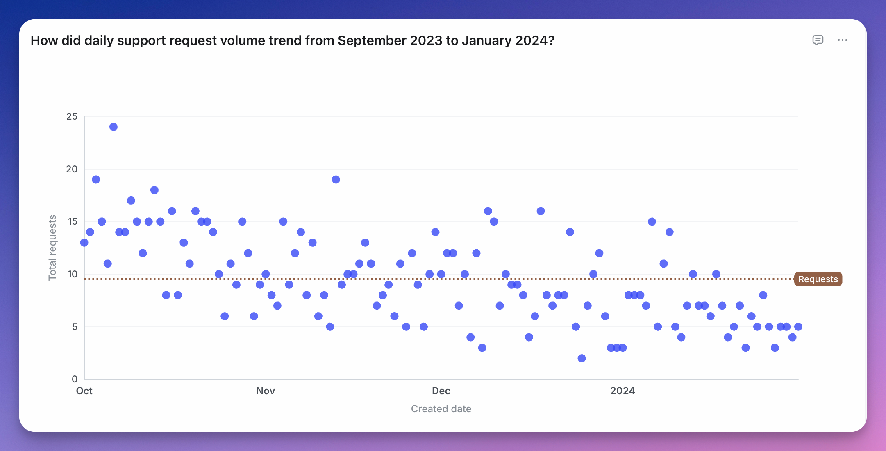
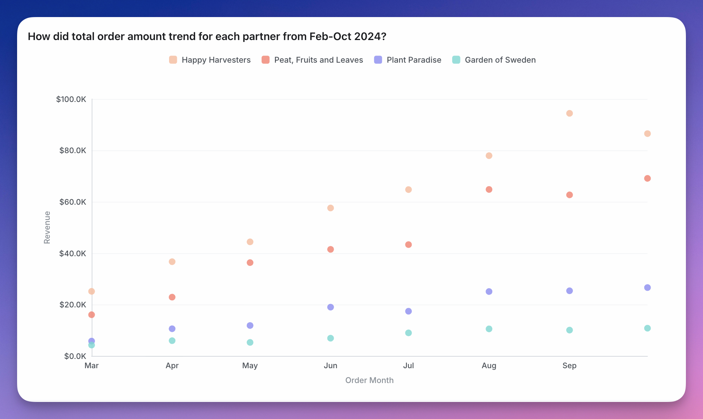

<Frame>
  
</Frame>

A scatter chart is useful if you want to to look at the relationship, a.k.a. correlation, between two variables. Something like the age of your users vs. the amount of time they've spent on your website.

You can group your scatter chart using a third variable. This will make the points on the scatter the same colour if they have the same group value.

<Frame>
  
</Frame>

You can see more details about scatter chart configurations [here](/explore/configure-charts).
