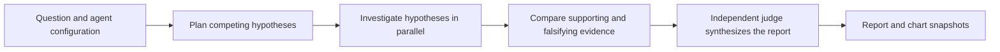

<Info>
  **Availability:** Deep research is a [Beta](/references/workspace/feature-maturity-levels) feature available on **Enterprise** plans. It is behind a feature flag. [Contact Lightdash](mailto:support@lightdash.com) to enable it for your organization.
</Info>

Deep research is a long-running mode for Lightdash AI agents. It is designed for questions that need several queries, competing explanations, and a reusable report rather than one immediate answer.

The agent investigates in the background using its Lightdash context and configured sources. It returns a structured Markdown report with confidence levels, supporting charts, citations for external sources, and explicit caveats.

<Frame>
  
</Frame>

## When to use deep research

<CardGroup cols={2}>
  <Card title="Use deep research" icon="telescope">
    Choose this mode for multi-step investigations that need cross-checking, several data cuts, or a report you can save and revisit.
  </Card>
  <Card title="Use Ask mode" icon="comment">
    Stay in the default mode for a quick lookup, one chart, or an interactive conversation where you want to steer each follow-up.
  </Card>
</CardGroup>

Questions that work well include:

- *"Which product categories are trending down this quarter, and what is driving the change?"*
- *"Why did returning-customer revenue fall over the last 90 days? Test the main explanations."*
- *"Compare paid and organic acquisition quality across our top three regions."*

## How it works

Deep research uses the selected AI agent's configuration, including its instructions, semantic-layer access, knowledge documents, project and repository context, and enabled tools. It automatically inherits the organization's research limits and every MCP server attached to the agent; there is no per-run depth or source selection.

For each run, a planner creates distinct, falsifiable hypotheses. Separate investigators test them in parallel, looking for both supporting and contradicting evidence. An independent judge then compares their findings and produces the final report. This structure helps the agent distinguish correlation from causation and makes inconclusive results explicit instead of forcing a single explanation.

Because the run executes on the server, you can close the tab or leave the thread. Reopening the thread restores the run card and its latest state.

## Start a run

<Steps>
  <Step title="Open Ask AI">
    Use the Ask AI composer on the homepage, start a new agent thread, or open an existing thread that you own. Deep research is unavailable in read-only threads, such as another user's thread or a thread started in Slack.
  </Step>
  <Step title="Enable Deep research">
    Select **Deep research** in a new conversation, or select the telescope icon in an existing conversation. The control changes color when the mode is active.
  </Step>
  <Step title="Describe the outcome you need">
    Include the decision or question, relevant time period, important segments, and any definitions or constraints the agent should preserve.
  </Step>
  <Step title="Start the investigation">
    Submit the question. Lightdash saves it in the thread, creates a durable run, and begins processing it in the background.
  </Step>
</Steps>

## Organization-wide limits

Organization admins set the safety limits inherited by every deep research run. Go to **Organization settings** → **Ask AI** → **Deep research** to configure:

- **Maximum tokens** — total model tokens across planning, parallel investigations, and judging
- **Maximum tool calls** — total tool calls across the run
- **Maximum warehouse queries** — total semantic-layer and SQL queries across the run
- **Maximum hypotheses** — number of competing explanations the planner creates and investigators test

Each limit must be a positive whole number. When a run reaches a limit after producing usable findings, Lightdash preserves the best available report and marks the run as partially completed.

By default, a run can use up to 10 million model tokens, 1,000 tool calls, 100 warehouse queries, and 5 hypotheses. Organization admins can change these values to match their governance and cost requirements.

## Sources and permissions

Deep research can use:

- **Agent context and project data** — the semantic layer, saved Lightdash content, knowledge documents, and other context configured on the selected agent, subject to its [data access settings](/guides/ai-agents/data-access).
- **Warehouse queries** — semantic queries and, when the agent and user are allowed to use it, SQL.
- **Repository context** — project context and source-code tools configured on the agent.
- **MCP servers** — every [server attached to the agent](/guides/ai-agents/mcp-servers) and its enabled tools.

<Warning>
  Deep research runs without pausing for approval on each warehouse query or MCP tool call. An attached MCP server can expose write actions, and its enabled actions can run unattended. Review the agent's attached servers and enabled tools before starting a run.
</Warning>

Deep research does not grant new permissions. The run starts with the creator's access and the selected agent's configuration, and Lightdash revalidates that access while the investigation runs. Revoking access or disconnecting a source can stop an active investigation or leave that source unavailable.

## Follow progress

The run card stays next to the question that started it and shows the latest phase, elapsed time, warehouse-query count, finding count, and recent activity.

<AccordionGroup>
  <Accordion title="Queued">
    Lightdash accepted the run and is waiting for a background worker to start it.
  </Accordion>
  <Accordion title="Running">
    The agent is planning hypotheses, investigating them in parallel, or synthesizing the report. Select **View activity** to inspect recent progress.
  </Accordion>
  <Accordion title="Completed">
    The full report is ready and saved in the thread.
  </Accordion>
  <Accordion title="Partially completed">
    The run reached a resource limit or recoverable error, but Lightdash preserved a usable report and its validated evidence.
  </Accordion>
  <Accordion title="Failed">
    The run could not produce a valid report. The run card keeps completed activity and provides safe retry guidance.
  </Accordion>
  <Accordion title="Cancelled">
    The creator stopped the run before it finished.
  </Accordion>
</AccordionGroup>

Select **Stop research** while a run is queued or running to request cancellation. Cancellation is asynchronous, so a running tool call may reach its next safe checkpoint before the status changes.

Only one deep research run can be active in a thread at a time. While it is active, the deep research control is disabled, but you can continue sending regular chat messages in the same thread. The control becomes available again when the run completes, partially completes, fails, or is cancelled.

## Read the report

Select **Open full report** from a completed or partially completed run card. A report contains:

<Frame>
  
</Frame>

- A direct introduction that answers the question and states overall confidence
- Two to five connected finding sections, each with a **low**, **medium**, or **high** confidence level
- Charts when visual evidence improves the explanation
- Caveats where data coverage, freshness, or the semantic layer limits the conclusion
- A conclusion and citations for external evidence

<Note>
  Confidence reflects the evidence available to the agent, not a guarantee that the conclusion is correct. Review the definitions, assumptions, and supporting queries before making a high-impact decision.
</Note>

### Chart snapshots and live data

Warehouse-backed charts open on a snapshot of the data the agent used when it wrote the report. This preserves the original evidence even if the underlying data changes later.

Select **Live data** on a warehouse-backed chart to rerun its stored query and compare the latest result with the snapshot. Charts computed by the agent from derived or external data have no single warehouse query and cannot be refreshed.

### Report retention

Deep research report content and chart snapshots expire **30 days after the run completes**. The run's question, status, and completion date remain in the thread. After expiry, select **Run again** to start a new investigation from the original question using the agent's current configuration and the organization's current limits.

The regular chat agent can use the status and report from deep research runs in the same conversation when answering follow-up questions. Ask it to clarify a finding, compare evidence, or explain a limitation without pasting the report back into the chat.

## Get better reports

- State the decision you are trying to make, not only the metric you want to inspect.
- Define ambiguous terms such as *active customer*, *conversion*, or *retention*.
- Include the time range and comparison period.
- Name segments the agent must test, such as channel, region, plan, or product category.
- Ask it to test alternatives or contradictions instead of assuming one cause.
- Treat a partially completed report as a starting point. Resolve unavailable sources or tighten the question before running it again; ask an organization admin to review the limits if runs repeatedly exhaust them.

## Access requirements

Starting a run requires the Enterprise **Start Deep Research runs** scope (`create:AiDeepResearch`) for the project. Developer and Admin roles receive this scope by default. Add it explicitly to any [custom role](/references/workspace/custom-roles) that should be allowed to start runs.

Users can only read, retry, or cancel their own deep research runs, and only within threads they are allowed to access.

## Frequently asked questions

**Do I have to keep the tab open?**

No. The run continues on the server and its state is saved in the thread.

**Can I start deep research in an existing conversation?**

Yes. You can start a run from an existing thread you own as long as the thread is not read-only and the agent's model is still available.

**Can I start another run while research is still active?**

Not in the same thread. You can keep chatting normally, or start deep research in another eligible thread. The control returns when the current run reaches a terminal state.

**Why did my run partially complete?**

The agent reached a resource budget or encountered a recoverable failure after producing a valid draft. Lightdash preserves the supported findings rather than discarding the report.

**Does deep research only read data?**

No. It uses the selected agent's configured tools. Warehouse queries run without individual approval, and attached MCP servers may include write actions. Review the agent's configuration before starting.

**Can I continue chatting after the report is ready?**

Yes. The report remains available in the thread for 30 days, and the same agent can use it as context for follow-up questions.
