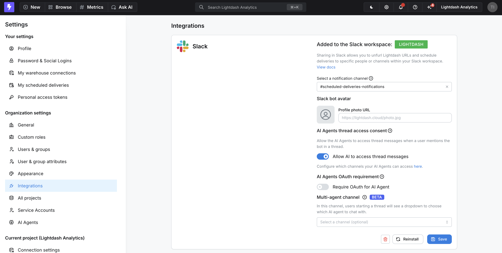
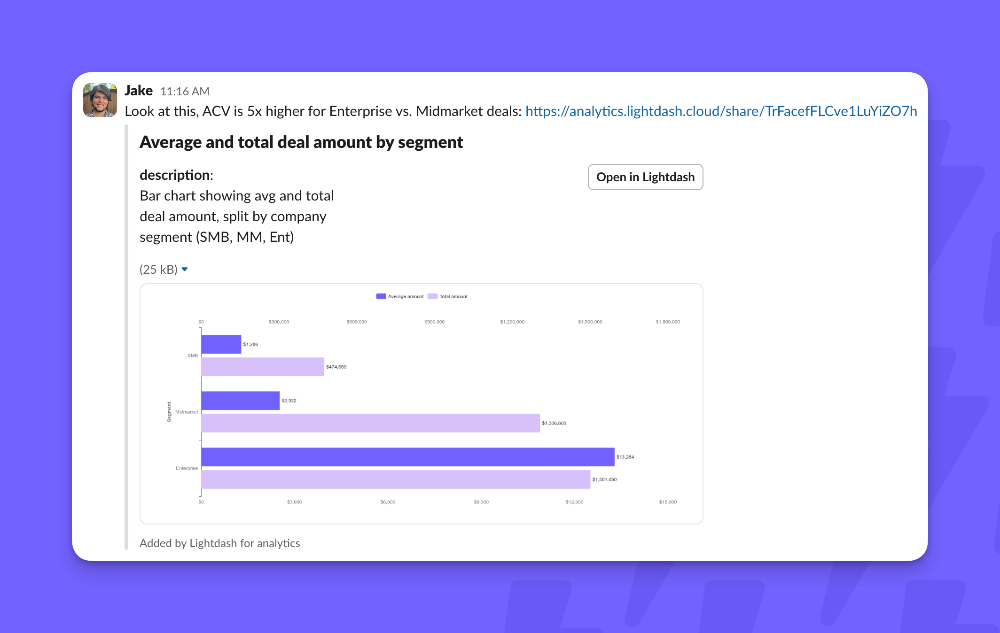
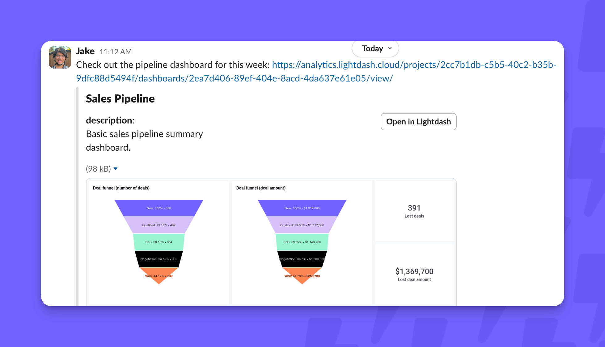
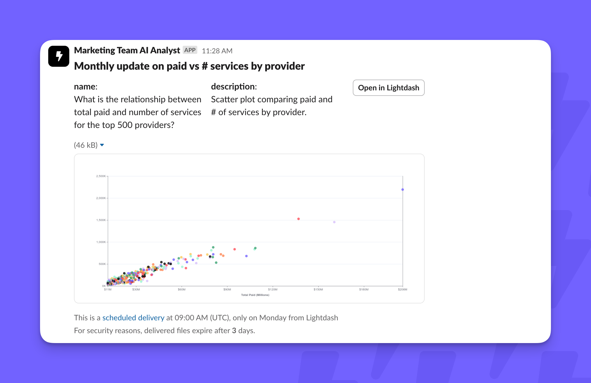
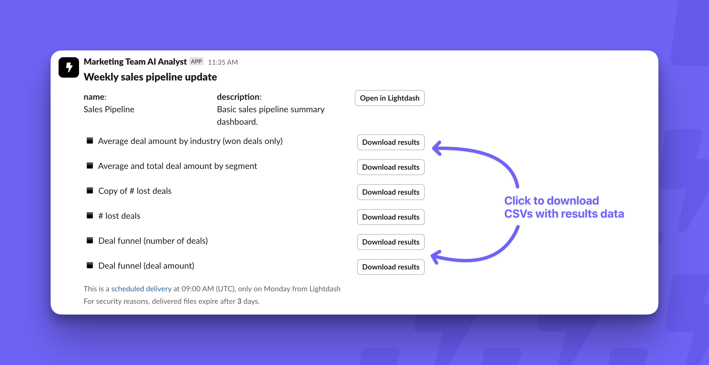
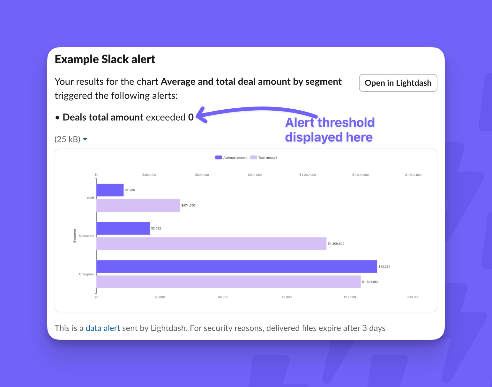
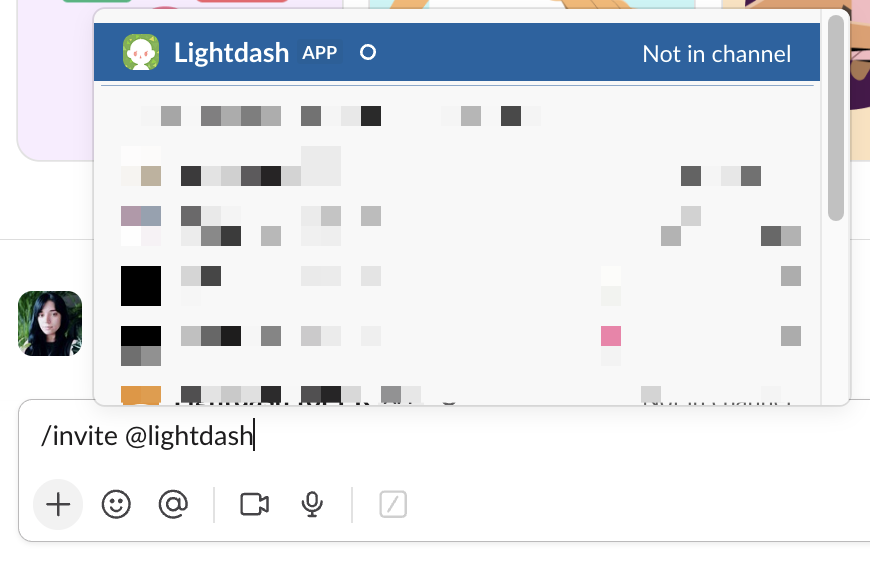
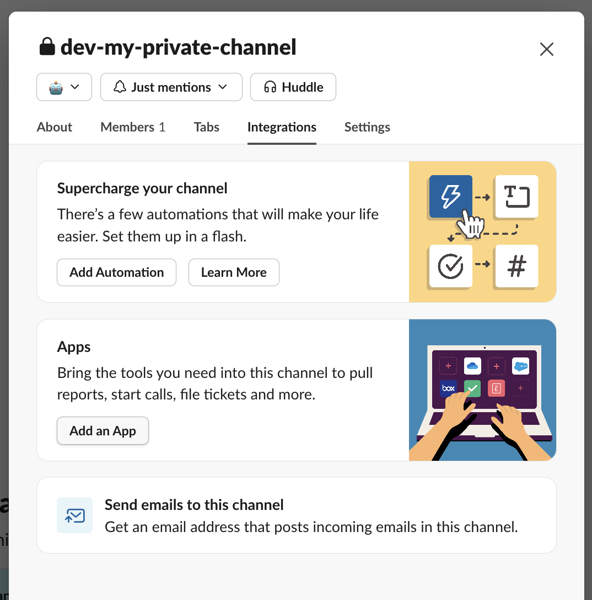
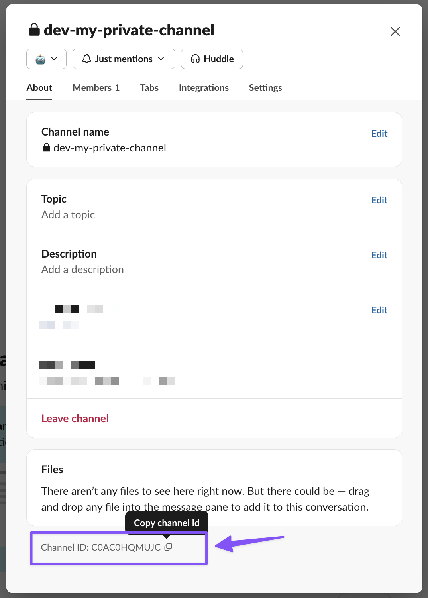
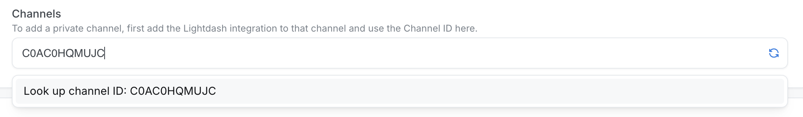

The Lightdash Slack app connects your project to Slack so your team can preview content, receive scheduled deliveries and alerts, and talk to AI agents without leaving their workspace.

## Install the Slack integration

<Info>
Only your Lightdash organization admins can add or configure the Slack integration.
</Info>

Go to **Organization settings**, then **Integrations**, and click **Add to Slack**. This opens a confirmation page granting the Lightdash Slack app access to your Lightdash and Slack organizations. If you're not a Slack admin, you might need to request approval to add the app. Once it's approved, you're all set.

<Note>
Self-hosting Lightdash? Creating and configuring the underlying Slack app is a platform setup step — see [Configure a Slack app for Lightdash](/self-host/customize-deployment/configure-a-slack-app-for-lightdash).
</Note>

This two-minute video shows the full install and configuration flow:

  <iframe
    src="https://www.loom.com/embed/9df1e9e24ead48cd8e46a73558d31764?sid=1daa03c8-c783-4f46-ad6e-8dabbd7d5223"
    frameborder="0"
    webkitallowfullscreen
    mozallowfullscreen
    allowfullscreen
    style={{
      position: 'absolute',
      top: 0,
      left: 0,
      width: '100%',
      height: '100%',
    }}
  ></iframe>

## Required permissions

The Lightdash Slack app requests these scopes:

- **`links:read` for lightdash.cloud** — lets Lightdash fetch information from the charts and dashboards you link so it can render previews in Slack.
- **`links:write`** — lets Lightdash unfurl those links.

No other content is shared from your workspace.

## Settings

After installing the app, you'll see these settings:

<Frame>

</Frame>

### Select a notification channel

Choose a Slack channel where Lightdash sends alerts when any scheduled delivery in your organization fails. Add the Lightdash app to that channel for notifications to work.

### Slack bot avatar

Customize the app's avatar by adding an image URL in the **Profile photo URL** field. Slack recommends a square image at least 512x512 pixels and no larger than 1024x1024 pixels.

### AI agents configuration

Control how AI agents interact with your Slack workspace — whether they can read thread messages when mentioned, and whether OAuth authentication is required to use them. For channel limitations and multi-agent support, see [Slack channels: single-agent vs. multi-agent](/agents/set-up-agents#slack-channels-single-agent-vs-multi-agent).

#### User attribution and OAuth

By default, every AI agent conversation in Slack is attributed to the user who installed the Slack app (or created the agent): all questions appear as if they came from that single user, and every query runs with that user's permissions.

Enable the **AI Agents OAuth requirement** toggle to identify each Slack user individually. When enabled:

- Each Slack user authenticates with Lightdash before using the AI agent.
- Conversations are attributed to the individual asking the question.
- Queries respect each user's own [user attributes and permissions](/agents/data-access#user-attributes-and-permissions).

<Tip>
Enable OAuth if your organization uses row- or column-level security through user attributes, or if you need an audit trail of which users ask which questions.
</Tip>

#### Automatic channel linking

When someone `@mentions` the Lightdash app in a channel that has no agent configured, Lightdash offers to link an agent to that channel from Slack — either auto-linking the user's one manageable agent, or posting an in-thread picker if the user manages several. See [Linking an agent from Slack](/agents/set-up-agents#linking-an-agent-from-slack) for the full flow.

The **Enable automatic channel linking** toggle controls this:

- **On (default)** — Slack mentions in unconfigured channels can add the channel to an agent's list, so first-time setup is seamless.
- **Off** — Slack mentions in unconfigured channels post an ephemeral message pointing to the AI agents page, and never modify an agent's channel list. Channels can only be managed from the agent settings UI.

Turn this off if you need the configured channel list to be a strict allowlist — for example, to prevent a sensitive agent from being extended into new channels by an admin's Slack activity. Turning it off does not affect channels that are already linked.

## Using the Slack integration

Once installed, the Slack integration surfaces Lightdash content and delivers it where your team already works. This video walks through the main ways to use it:

<iframe src="https://www.loom.com/embed/5ba2d4b3ad8445b18e1ad233a4c0f930?sid=488d516a-adcc-4915-9ad7-0c186b10eecc" frameborder="0" webkitallowfullscreen mozallowfullscreen allowfullscreen style={{ width: '100%', height: '400px' }} ></iframe>

### Unfurl Lightdash links

The app automatically unfurls links you share from your Lightdash project. Invite the app to a channel first, and it will unfurl links there — both links copied from the URL bar and "share" links copied with the link icon. Chart and dashboard links are supported.

<Note>
Link previews are generated with the credentials of the user who installed the Slack app, so previews reflect that user's data access — not the permissions of whoever shares the link. If the installer's warehouse session expires, previews fail until they re-authenticate.
</Note>

Here's an unfurled chart:

<Frame>
  
</Frame>

And an unfurled dashboard:

<Frame>
  
</Frame>

### Scheduled deliveries

Use Slack as a destination for [scheduled deliveries](/explore/create-scheduled-deliveries). Schedule refreshes for charts or dashboards and push the results into a Slack channel or DM.

Charts look like this when you attach an image:

<Frame>
  
</Frame>

And dashboards look like this when you choose _not_ to include an image:

<Frame>
  
</Frame>

### Saved chart alerts in Slack

Beyond scheduled deliveries, you can set up [alerts on saved charts](/explore/create-alerts) that only send to Slack when your criteria are met.

<Frame>
  
</Frame>

### Use Lightdash in private channels

Slack doesn't expose private channels to apps by default, so add the Lightdash app to a private channel manually. Either:

- **Invite the app** — type `/invite @Lightdash` in the channel.

<Frame>
  
</Frame>

- **Use channel settings** — click the channel name, go to **Integrations → Add an app**, then search for and add Lightdash.

<Frame>
  
</Frame>

Once the app is added, find the channel in Lightdash by either:

- **Refreshing the channel list** in the Lightdash UI, or
- **Looking up the channel by ID** — in Slack, right-click the channel name, select **View channel details**, and copy the Channel ID from the bottom of the modal.

<Frame>
  
</Frame>

Paste the channel ID into the Channels input field and select **Look up channel ID** to find your private channel.

<Frame>
  
</Frame>

### AI analyst agents

AI analyst agents use the Slack integration to chat with your data and build charts in Slack. Once you have access to AI analysts, give them access to Slack threads in your integration settings.

Trigger a response by mentioning the Lightdash app in your message. There's a single Lightdash app to mention — you don't specify a particular agent. Lightdash routes your question to the most appropriate agent, and prompts you to choose if it's unclear.

<Note>
By default, all Slack AI agent conversations are attributed to the user who installed the Slack app. To attribute conversations to individual Slack users and respect their data permissions, enable the **AI Agents OAuth requirement** in your [Slack integration settings](#ai-agents-configuration).
</Note>
