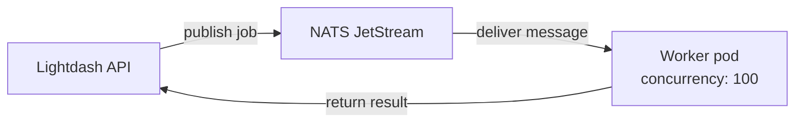

<Badge color="blue" size="md" shape="pill">Helm chart</Badge>

<Callout icon="wrench" color="#6B7280">
  This page is for engineering teams self-hosting their own Lightdash instance.
</Callout>

By default, Lightdash processes all queries on the main API server. NATS workers move query execution onto dedicated pods, improving responsiveness under load and letting you scale query capacity independently.

Lightdash uses [NATS](https://nats.io/) — a lightweight, high-performance messaging system — with [JetStream](https://docs.nats.io/nats-concepts/jetstream), its built-in persistent streaming layer, to distribute work between the API server and worker pods.

NATS powers two opt-in features in Lightdash:

<CardGroup cols={2}>
  <Card title="Warehouse workers" icon="database" horizontal href="/self-host/nats-workers/warehouse-workers">
    Process interactive and background warehouse queries on dedicated pods.
  </Card>
  <Card title="Pre-aggregate workers" icon="layer-group" horizontal href="/self-host/nats-workers/pre-aggregate-workers">
    Materialize pre-aggregates and serve queries from DuckDB.
  </Card>
</CardGroup>

## Requirements

- **Helm chart** version **2.7.2** or later
- **Lightdash** version [**0.2675.0**](https://hub.docker.com/r/lightdash/lightdash/tags) or later. Older images will fail with `MODULE_NOT_FOUND`.

<Note>
  Upgrading the Helm chart alone does not change how Lightdash works. NATS features are entirely opt-in — your existing deployment will behave exactly the same until you explicitly enable the new Helm values described below.
</Note>

## Architecture



The Lightdash API publishes jobs to NATS JetStream. Worker pods consume messages from their stream and process them concurrently (default 100 concurrent jobs per pod).

## Enabling NATS

```yaml
nats:
  enabled: true
  config:
    cluster:
      enabled: false
    jetstream:
      enabled: true
      fileStore:
        enabled: false
      memoryStore:
        enabled: true
        maxSize: 1Gi
```

The JetStream configuration shown above reflects the defaults when `nats.enabled` is set to `true`. This deploys a NATS StatefulSet and sets `NATS_ENABLED=true` on the backend, which means the backend will start routing queries through NATS. You should always enable at least a [warehouse worker](/self-host/nats-workers/warehouse-workers) alongside NATS to process those queries — otherwise queries will be enqueued with no worker to pick them up.

<Warning>
  Do not enable `nats.enabled: true` without also enabling `warehouseNatsWorker.enabled: true`. The backend routes queries to NATS when `NATS_ENABLED` is set, so queries will stall if no worker is running to process them.
</Warning>

## Auto-configured environment variables

The chart automatically sets these environment variables in the shared ConfigMap — you do not need to set them manually:

| Variable | Set when | Value |
| --- | --- | --- |
| `NATS_ENABLED` | `nats.enabled: true` | `"true"` |
| `NATS_URL` | `nats.enabled: true` | `nats://<release>-nats:4222` |

Additional environment variables are auto-configured per worker deployment — see [Warehouse workers](/self-host/nats-workers/warehouse-workers) and [Pre-aggregate workers](/self-host/nats-workers/pre-aggregate-workers) for details.

## NATS JetStream configuration

JetStream supports two [storage backends](https://docs.nats.io/nats-concepts/jetstream/streams#storagetype) — we recommend memory store, but you can use file store depending on your needs.

### Memory store vs file store

| | Memory store (recommended) | File store |
| --- | --- | --- |
| **How it works** | Messages are held in RAM | Messages are persisted to disk |
| **Performance** | Faster — no disk I/O overhead | Slower — writes go through disk |
| **Persistence** | Messages are lost if NATS restarts | Messages survive NATS restarts |
| **Infrastructure** | No PersistentVolumeClaim needed | Requires a PersistentVolumeClaim |
| **When to use** | Most deployments. Lightdash messages are small (just a query UUID) and are deleted once processed. | High message volume exceeding available RAM, or if you need messages to survive NATS pod restarts. |

For more details, see the NATS documentation on [JetStream](https://docs.nats.io/nats-concepts/jetstream) and [stream storage types](https://docs.nats.io/nats-concepts/jetstream/streams#storagetype).

### Configuration reference

```yaml
nats:
  enabled: true
  config:
    cluster:
      enabled: false          # single-node NATS, no clustering
    jetstream:
      enabled: true
      fileStore:
        enabled: false         # no disk persistence
      memoryStore:
        enabled: true
        maxSize: 1Gi           # max memory for message storage
```

| Setting | Recommended | Description |
| --- | --- | --- |
| `nats.config.jetstream.memoryStore.enabled` | `true` | Enable memory-backed storage |
| `nats.config.jetstream.memoryStore.maxSize` | `1Gi` | Maximum memory for JetStream message storage |
| `nats.config.jetstream.fileStore.enabled` | `false` | Enable disk-backed storage |
| `nats.config.cluster.enabled` | `false` | Single-node NATS (no clustering) |

### Pod disruption

NATS is a stateful component — if the NATS pod restarts, in-flight messages are lost (queries will be retried by users). The chart protects against unplanned eviction with:

- `cluster-autoscaler.kubernetes.io/safe-to-evict: "false"` annotation
- `PodDisruptionBudget` with `maxUnavailable: 0`
