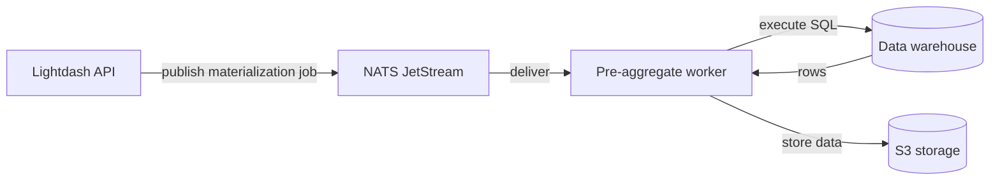
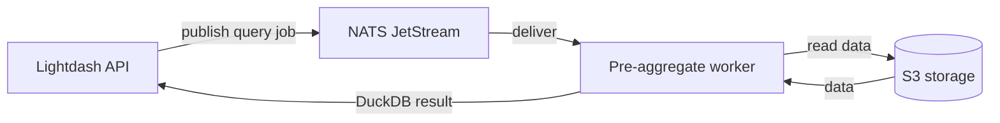

<Badge color="purple" size="md" shape="pill">Enterprise plan</Badge> <Badge color="blue" size="md" shape="pill">Helm chart</Badge>

Pre-aggregate workers handle two jobs:

1. **Materializations** — Run a query against your warehouse, convert the results to a materialization format, and upload to S3
2. **DuckDB queries** — When a user query [matches a pre-aggregate](/references/pre-aggregates/overview#query-matching), read the materialized data from S3 and execute the query using DuckDB

Both job types are distributed via the NATS `pre-aggregate` stream.

### Pre-aggregate materializations

Scheduled jobs materialize warehouse query results and store them on S3:



### Pre-aggregate queries

When a user query matches a pre-aggregate, the worker serves it using DuckDB against materialized data on S3 — without hitting your data warehouse:



## Prerequisites

- A valid [Enterprise license key](/self-host/customize-deployment/enterprise-license-keys)
- An S3-compatible bucket for materialized data (AWS S3, GCS, MinIO)
- NATS and warehouse workers enabled (see [NATS workers overview](/self-host/nats-workers/overview))

## Example configuration

A complete Helm values configuration with NATS, warehouse worker, and pre-aggregate worker:

```yaml
nats:
  enabled: true
  config:
    cluster:
      enabled: false
    jetstream:
      enabled: true
      fileStore:
        enabled: false
      memoryStore:
        enabled: true
        maxSize: 1Gi

warehouseNatsWorker:
  enabled: true
  replicas: 1
  concurrency: 100
  resources:
    requests:
      cpu: 250m
      memory: 1.5Gi
    limits:
      memory: 1.5Gi

preAggregateNatsWorker:
  enabled: true
  replicas: 1
  concurrency: 100
  resources:
    requests:
      cpu: 650m
      memory: 4Gi
      ephemeral-storage: 9Gi
    limits:
      memory: 4Gi
      ephemeral-storage: 9Gi
```

The Helm chart auto-configures these environment variables:

| Variable | Set from | Value |
| --- | --- | --- |
| `NATS_ENABLED` | `nats.enabled: true` | `"true"` |
| `NATS_URL` | `nats.enabled: true` | `nats://<release>-nats:4222` |
| `NATS_WORKER_CONCURRENCY` | `preAggregateNatsWorker.concurrency` | `100` |
| `PRE_AGGREGATES_ENABLED` | `preAggregateNatsWorker.enabled: true` | `"true"` |
| `PRE_AGGREGATES_PARQUET_ENABLED` | `preAggregateNatsWorker.enabled: true` | `"true"` |

See the [overview](/self-host/nats-workers/overview) for details on JetStream configuration options.

## S3 storage configuration

Pre-aggregates require a **dedicated S3 bucket** separate from your main Lightdash results cache bucket. This prevents query history cleanup from deleting active materialization files.

| Variable | Required | Description | Fallback |
| --- | --- | --- | --- |
| `S3_ENDPOINT` | Yes | S3-compatible endpoint URL | — |
| `PRE_AGGREGATE_RESULTS_S3_BUCKET` | Yes | Dedicated bucket for materialized data | — |
| `PRE_AGGREGATE_RESULTS_S3_REGION` | Yes | S3 region for the bucket | — |
| `PRE_AGGREGATE_RESULTS_S3_ACCESS_KEY` | No | Access key for the bucket | `S3_ACCESS_KEY` |
| `PRE_AGGREGATE_RESULTS_S3_SECRET_KEY` | No | Secret key for the bucket | `S3_SECRET_KEY` |

`S3_ENDPOINT` and `S3_FORCE_PATH_STYLE` are inherited from your base [S3 configuration](/self-host/customize-deployment/configure-lightdash-to-use-external-object-storage). Access keys fall back to the base S3 credentials if not set separately.

<Warning>
  The credentials used for the pre-aggregate bucket must have **`s3:PutObject`** permission (in addition to `s3:GetObject`, `s3:ListBucket`, and `s3:DeleteObject`). Without `PutObject`, materialization jobs will fail to upload results to the bucket. On other S3-compatible storage (GCS, MinIO), grant the equivalent write permission.
</Warning>

<Tabs>
  <Tab title="AWS S3">
    ```yaml
    configMap:
      S3_ENDPOINT: "https://s3.us-east-1.amazonaws.com"
      PRE_AGGREGATE_RESULTS_S3_BUCKET: "my-lightdash-pre-aggs"
      PRE_AGGREGATE_RESULTS_S3_REGION: "us-east-1"
    secrets:
      PRE_AGGREGATE_RESULTS_S3_ACCESS_KEY: "AKIA..."
      PRE_AGGREGATE_RESULTS_S3_SECRET_KEY: "..."
    ```
  </Tab>
  <Tab title="Google Cloud Storage">
    GCS is S3-compatible via [HMAC keys](https://cloud.google.com/storage/docs/authentication/hmackeys). Generate an HMAC key pair in **Cloud Storage > Settings > Interoperability**.

    ```yaml
    configMap:
      S3_ENDPOINT: "https://storage.googleapis.com"
      PRE_AGGREGATE_RESULTS_S3_BUCKET: "my-lightdash-pre-aggs"
      PRE_AGGREGATE_RESULTS_S3_REGION: "auto"
    secrets:
      PRE_AGGREGATE_RESULTS_S3_ACCESS_KEY: "GOOG..."
      PRE_AGGREGATE_RESULTS_S3_SECRET_KEY: "..."
    ```
  </Tab>
  <Tab title="MinIO">
    ```yaml
    configMap:
      S3_ENDPOINT: "https://minio.example.com"
      S3_FORCE_PATH_STYLE: "true"
      PRE_AGGREGATE_RESULTS_S3_BUCKET: "lightdash-pre-aggs"
      PRE_AGGREGATE_RESULTS_S3_REGION: "us-east-1"
    secrets:
      PRE_AGGREGATE_RESULTS_S3_ACCESS_KEY: "minioadmin"
      PRE_AGGREGATE_RESULTS_S3_SECRET_KEY: "..."
    ```
  </Tab>
</Tabs>

<Tip>
  We recommend setting a **retention / lifecycle policy** on the pre-aggregate bucket to automatically clean up old files. Lightdash manages its own materializations, but a lifecycle policy prevents orphaned files from accumulating. Choose a retention period that makes sense for your deployment.
</Tip>

## Configuration reference

All configuration is set through your Helm `values.yaml` under `preAggregateNatsWorker`:

### Scaling

| Helm value | Default | Description |
| --- | --- | --- |
| `preAggregateNatsWorker.replicas` | `1` | Number of worker pods. Scale horizontally for more parallel capacity. |
| `preAggregateNatsWorker.concurrency` | `100` | Maximum concurrent jobs per pod. Maps to `NATS_WORKER_CONCURRENCY` env var. |

### Resources

| Helm value | Recommended (request) | Recommended (limit) | Description |
| --- | --- | --- | --- |
| `preAggregateNatsWorker.resources.requests.cpu` | `650m` | — | CPU request per pod |
| `preAggregateNatsWorker.resources.requests.memory` | `4Gi` | `4Gi` | Memory request and limit per pod |
| `preAggregateNatsWorker.resources.requests.ephemeral-storage` | `9Gi` | `9Gi` | Local disk for temporary files during materialization |

Pre-aggregate workers need significantly more resources than warehouse workers because they run **DuckDB in-process** for both materializing data and serving queries against materialized data.

<Warning>
  **Ephemeral storage is critical.** During materialization, warehouse query results are written to a local temporary file before being converted and uploaded to S3. Large materializations can consume several gigabytes of local disk. If the pod runs out of ephemeral storage, it will be evicted.
</Warning>

### DuckDB memory tuning

DuckDB runs inside the pre-aggregate worker process. There are two types of DuckDB instances:

| Instance type | Used for | Memory limit | Concurrency |
| --- | --- | --- | --- |
| **Shared query instance** | Serving pre-aggregate queries | Configurable (see below) | Shared across all concurrent queries |
| **Isolated materialization instances** | Converting and uploading results | 256MB per instance, 1 thread | One per active materialization |

By default, the shared query instance has **no memory cap**. Under concurrent load, this can cause OOM kills. Set a limit:

```yaml
configMap:
  PRE_AGGREGATE_DUCKDB_QUERY_MEMORY_LIMIT: "3GB"
```

**Sizing guideline:** Start with 2–3GB and adjust based on observed memory usage. The limit should leave enough headroom for the Node.js process, active materializations, and OS overhead within the pod's total memory.

### Optional environment variables

These can be set via `extraEnv` or `configMap` if you need to override the defaults:

| Variable | Default | Description |
| --- | --- | --- |
| `NATS_QUEUE_TIMEOUT_MS` | `180000` (3 min) | How long a message can wait in the queue before being discarded. |
| `PRE_AGGREGATE_DUCKDB_QUERY_MEMORY_LIMIT` | Unlimited | Memory cap for the shared DuckDB query instance (e.g., `2GB`, `3GB`). When unset, DuckDB will use all available pod memory and is likely to cause OOM kills under concurrent load. We strongly recommend setting this. |
| `PRE_AGGREGATES_MAX_ROWS` | Unlimited | Maximum rows per materialization. Results are truncated to this limit with a warning. Can also be set per pre-aggregate in dbt YAML via `max_rows`. |

## Troubleshooting

### Pre-aggregate queries hitting the warehouse instead of DuckDB

1. Verify that `PRE_AGGREGATES_ENABLED` is set to `"true"` on the pre-aggregate worker pod
2. Verify that `PRE_AGGREGATES_PARQUET_ENABLED` is set to `"true"` on the pre-aggregate worker pod
3. Confirm the pre-aggregate worker pod is running and healthy
4. Check that an active materialization exists in **Project Settings > Pre-aggregates**
5. Review query matching rules — see [monitoring and debugging](/references/pre-aggregates/monitoring)

### Worker OOM kills

Pre-aggregate workers run DuckDB which can consume significant memory:

1. Set `PRE_AGGREGATE_DUCKDB_QUERY_MEMORY_LIMIT` (e.g., `3GB`) to cap DuckDB memory
2. Increase the worker's memory request and limit
3. Reduce `concurrency` to limit parallel DuckDB queries

### Materialization failures

Common causes:
- **S3 access denied** — Verify `PRE_AGGREGATE_RESULTS_S3_*` credentials and bucket permissions
- **Warehouse timeout** — Large materializations may exceed warehouse query timeout limits
- **Disk pressure** — Materialization writes temporary files to local disk. Increase ephemeral storage if you see evictions.
- **Too many rows** — Materializations should not contain very large datasets. We recommend keeping materializations under 100,000 rows for optimal performance. You can use `max_rows` in your [pre-aggregate definition](/references/pre-aggregates/getting-started#row-limits) or the `PRE_AGGREGATES_MAX_ROWS` environment variable to enforce a limit.
