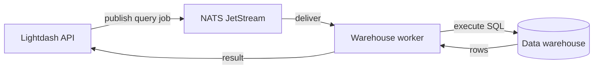

<Badge color="blue" size="md" shape="pill">Helm chart</Badge>

Warehouse workers process interactive and background SQL queries against your data warehouse. When a user runs a query in Lightdash, the API server publishes a job to the NATS `warehouse` stream, and a warehouse worker picks it up, executes the SQL, and returns the results.



## Example configuration

A complete Helm values configuration with NATS and a warehouse worker:

```yaml
nats:
  enabled: true
  config:
    cluster:
      enabled: false
    jetstream:
      enabled: true
      fileStore:
        enabled: false
      memoryStore:
        enabled: true
        maxSize: 1Gi

warehouseNatsWorker:
  enabled: true
  replicas: 1
  concurrency: 100
  resources:
    requests:
      cpu: 250m
      memory: 1.5Gi
    limits:
      memory: 1.5Gi
```

The chart auto-configures `NATS_ENABLED=true` and `NATS_URL` for you. See the [overview](/self-host/nats-workers/overview) for details on JetStream configuration options.

## Configuration reference

All configuration is set through your Helm `values.yaml` under `warehouseNatsWorker`:

### Scaling

| Helm value | Default | Description |
| --- | --- | --- |
| `warehouseNatsWorker.replicas` | `1` | Number of worker pods. Scale horizontally for more parallel query capacity. |
| `warehouseNatsWorker.concurrency` | `100` | Maximum concurrent jobs per pod. Maps to `NATS_WORKER_CONCURRENCY` env var. |

### Resources

| Helm value | Recommended (request) | Recommended (limit) | Description |
| --- | --- | --- | --- |
| `warehouseNatsWorker.resources.requests.cpu` | `250m` | — | CPU request per pod |
| `warehouseNatsWorker.resources.requests.memory` | `1.5Gi` | `1.5Gi` | Memory request and limit per pod |

### Auto-configured environment variables

These are set by the Helm chart:

| Variable | Set from | Value |
| --- | --- | --- |
| `NATS_ENABLED` | `nats.enabled: true` | `"true"` |
| `NATS_URL` | `nats.enabled: true` | `nats://<release>-nats:4222` |
| `NATS_WORKER_CONCURRENCY` | `warehouseNatsWorker.concurrency` | `100` |

### Optional environment variables

These can be set via `extraEnv` or `configMap` if you need to override the defaults:

| Variable | Default | Description |
| --- | --- | --- |
| `NATS_QUEUE_TIMEOUT_MS` | `180000` (3 min) | How long a message can wait in the queue before being discarded. |

## Troubleshooting

### Queries timing out

If workers are busy, messages may expire before being processed. Scale up replicas or concurrency.

### Worker OOM kills

Increase the memory request and limit. Large query result sets are held in memory during processing.

### NATS connection errors

1. Confirm the NATS pod is running and healthy
2. Verify that `NATS_URL` is set correctly on the warehouse worker pod (should be `nats://<release>-nats:4222`)
3. Check that your network policies allow traffic between the worker pods and the NATS service on port `4222`
