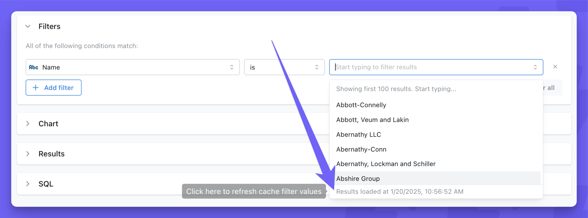
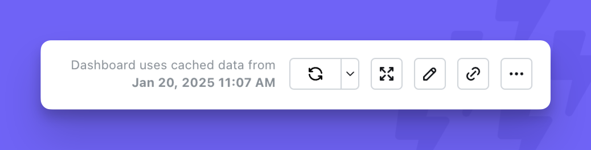

<Info>
  **Availability:** Caching features are only available to:
  - **Lightdash Cloud customers** (all plans)
  - **On-premise customers with a valid License key**
</Info>

Lightdash supports two types of caching:

1. **[Cached Filter values](#filter-value-caching)** - enabled for every cloud user without requiring any configuration.
2. **[Cached results for Charts and Dashboards](#chart-and-dashboard-results-caching)** - only available for Cloud Pro or above and must be enabled by the Lightdash team.

<Note>
  Results caching is **not enabled by default**, even on paid plans. To check if caching is active on your instance, look for a cache timestamp in the dashboard header. If no time is displayed, caching is not enabled. Contact the Lightdash team to enable it.
</Note>

## Filter value caching

This type of caching works without any configuration for cloud users. You'll see a message in your filter values that tells you when the cached filter values were loaded from (usually within the last day). If you want to refresh the filter values, you can click on that message and the values will be refreshed.

If you search filter values by starting to type, Lightdash will also cache those values so the next time you need the same search the values will be shown much faster.

## Chart and dashboard results caching

Popular charts and dashboards will load faster when caching is enabled. The first user to visit a chart or dashboard each day will load fresh results from the warehouse, which get cached. After that, all following visits to the same chart or dashboard will load from the cached results.

Any changes to the chart query or dashboard queries (user attributes, filters, limit, date zoom) will trigger new queries to the warehouse and create a separate cached results entry.

Caching popular charts and dashboards will reduce warehouse costs to the organization by reducing the number of queries; it also improves server performance and makes the user experience much faster in Lightdash.

### Scope of the cache

When caching is enabled, it applies to your **entire Lightdash instance**. There is currently no way to enable caching for specific projects or individual dashboards. It's all or nothing.

These Lightdash features use caching (if it's enabled on your instance):

- **Saved Charts** are cached based on the last refresh in any context (edit mode, view mode, dashboard refresh, etc.), but queries made while editing are NOT cached or pulled from cache.
- **Dashboard tiles** (internal and embedded) will use the cache from saved charts they reference. If charts only exist on a single dashboard, they will refresh whenever you click the Refresh button on the dashboard.
- **Scheduled Deliveries** generate and use cached results for the saved chart or dashboard they belong to.
- **Google Sheets syncs** also use cached results. If you need syncs to always return fresh data, be aware that enabling caching will cause syncs to deliver cached results until the cache expires.
- **SQL runner queries** including saved SQL charts and dashboard SQL chart tiles are cached through the same execution path as metric-based charts. Note that the SQL runner does not have a UI button to force-refresh or invalidate the cache — results remain cached until the cache expires.
- **Metrics Catalog** queries go through the same async query service and are cached like any other query.
- **[Data apps](/data-apps)** run every metric query through the same async query service and are cached like any other query, including live-linked charts. The **Refresh** button in the app preview invalidates the cache for that app and re-queries the warehouse fresh for the rest of the session, the same way the dashboard refresh button does. Because the cache key is project ID plus generated SQL, apps with lots of interactive filter controls produce more distinct cache entries than an equivalent dashboard — the first hit on each filter combination still goes to the warehouse.

These Lightdash features DO NOT use caching:

- **Editing a saved chart** — actions in edit mode (such as changing columns, filters, or other query parameters) explicitly bypass the cache to ensure you always see fresh results while building a query.
- **[External connections](/data-apps/external-connections) in data apps** — requests to third-party HTTP APIs are runtime fetches through the Lightdash proxy and are not covered by results caching.

### Cache Mechanism

The cache is stored in S3 and the cache identifier is based on the project ID and the generated SQL. This means that any change to the selected columns, filters, joins, user attributes, etc. will trigger a new query to the warehouse and add a new cache entry for that query.

### User-level caching

When a project is configured to [require user credentials](/personal-settings/personal-warehouse-connections), cached results are scoped to each individual user. This means:

- Each user's queries are cached separately based on their personal warehouse credentials
- Users cannot access cached results from other users' queries
- This ensures data access controls are maintained at the individual user level

### Filtering with time values and caching

When using filters with datetime values, the specificity of the time component affects caching behavior:

- **Dynamic datetime values with seconds** (e.g., `12:11:25`) will generally not benefit from caching because each query generates a unique timestamp, creating a new cache entry every time.
- **Definite times** (e.g., `12:00:00`) or **dates without time components** will cache effectively because they produce consistent SQL queries that can be reused.

**Best practices for cacheable time filters:**
- Use date-only filters when possible (e.g., `2024-01-15` instead of `2024-01-15 12:11:25`)
- Round times to the nearest hour or fixed interval (e.g., `12:00:00` instead of `12:11:25`)
- Avoid filters that use dynamic "current time" functions with second precision

This ensures your queries can leverage cached results and reduce warehouse load.

### Cache Expiry and Invalidation

Cached results automatically expire after 24 hours by default. The expiry time is configurable at the organization level, but you'll need to reach out to the Lightdash team.

Cache expiry is **rolling, not scheduled**. It's based on the age of each cached result, not a fixed time of day. For example, if a dashboard is first loaded at 2:00 PM, its cache expires at 2:00 PM the next day. This means different dashboards and charts may have different cache ages depending on when they were last refreshed.

<Tip>
If your dashboards report on "yesterday's data" and you want users to always see fresh results in the morning, consider setting a shorter cache duration (e.g., 8 hours) so that results cached during the workday expire overnight. Contact the Lightdash team to adjust your cache duration.
</Tip>

The dashboard header displays the date and time of the chart with the oldest cache. If no time is displayed, then no charts are cached. You can invalidate and refresh cached dashboard results by pressing the dashboard refresh button.

<Info>
  There is currently no way to invalidate cached results for individual Saved Charts.
</Info>

## Results caching vs pre-aggregates

Lightdash has two independent systems for speeding up queries: **results caching** (documented above) and **pre-aggregates**. They work differently and are designed to be used together, not as replacements for each other.

### Results caching

Results caching stores the exact result of any query that runs through Lightdash, keyed by a hash of the generated SQL, and serves subsequent identical queries from S3 until the entry expires (24 hours by default). It covers every query shape — including custom metrics, table calculations, and SQL runner queries — but the first run of each unique query still hits your warehouse, and any change to the query (a different filter, column, limit, or user attribute) produces a new entry and another warehouse query.

### Pre-aggregates

[Pre-aggregates](/semantic-layer/pre-aggregates) are summary tables you define in your dbt YAML. Lightdash materializes them on a schedule (or on compile, or manually) and stores the results in S3. When a user query matches the pre-aggregate's dimensions, metrics, filters, and granularity, Lightdash serves the query from the materialized data using in-memory DuckDB workers. The warehouse is not touched at query time, even on the first query.

A single pre-aggregate can serve many different queries. A daily pre-aggregate with five dimensions can answer day, week, month, quarter, and year queries across any subset of those dimensions and with any narrower filter. Results caching, in contrast, needs one cache entry per unique SQL.

### Key differences

|                              | Results caching                                    | Pre-aggregates                                                         |
| ---------------------------- | -------------------------------------------------- | ---------------------------------------------------------------------- |
| **Configuration**            | Automatic once enabled for your instance           | Defined in dbt YAML                                                    |
| **Trigger**                  | First query runs against warehouse, then cached    | Materialized on compile, cron, or manual refresh                       |
| **Storage**                  | Query result (row set)                             | Pre-computed summary table                                             |
| **Query execution**          | Exact cached result is returned                    | DuckDB workers re-aggregate at query time                              |
| **Warehouse hit on first query?** | Yes                                           | No — only materialization hits the warehouse, not query-time serving    |
| **Coverage**                 | All metric types, all query shapes                 | Only re-aggregatable metrics (sum, count, min, max, average)           |
| **Scope**                    | One cache entry per unique SQL                     | One pre-aggregate can serve many query shapes                          |
| **Availability**             | Cloud Pro+ or self-hosted with license             | Enterprise (Beta)                                                      |

### When to use which

**Use pre-aggregates when:**

- You have high-traffic dashboards with predictable query patterns
- You want to reduce warehouse cost or improve latency on the first query, not just repeat visits
- The metrics are re-aggregatable (sum, count, min, max, average)
- You're willing to design and schedule the materializations

**Use results caching when:**

- Query patterns are ad-hoc or unpredictable
- You need features that pre-aggregates don't support, such as `count_distinct`, [Parameters](/semantic-layer/parameters), [`sql_filter`](/semantic-layer/tables#sql-filter-row-level-security), or raw SQL table calculations
- You're using the SQL runner
- You don't want upfront configuration work

<Tip>
  In most cases, both should be enabled. Pre-aggregates handle your heaviest, most predictable workloads. Results caching is the safety net for everything else.
</Tip>

### Using both together

When both systems are enabled, they act as two layers of caching. A query that matches a pre-aggregate is served from the materialized data by DuckDB workers. The result of that DuckDB query can then be stored in the results cache, so subsequent identical requests skip even the DuckDB step and return the cached result directly. This means pre-aggregates eliminate the warehouse hit, and results caching eliminates repeated computation on top of that.