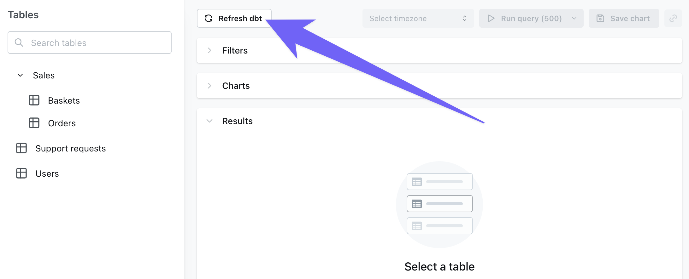

<Info>
  Lightdash supports dbt v1.4.0 and above. If you are using an older version of dbt, you will need to upgrade to sync your project to Lightdash.
</Info>

## Syncing your dbt project to Lightdash

There are five ways to sync changes from dbt into Lightdash. They differ in **where the code comes from**, **where compilation happens**, **which `profiles.yml` / target governs the result**, and **whether they respect the project's UI Connection Settings**.

For ready-to-use workflow templates, see the [`lightdash/cli-actions`](https://github.com/lightdash/cli-actions) repo.

### Sync mechanisms

<AccordionGroup>
  <Accordion title="1. lightdash deploy from a developer's laptop">
    Compiles the dbt project locally and pushes the resulting `manifest.json` to Lightdash.

    | Property                              | Value                                                                       |
    | ------------------------------------- | --------------------------------------------------------------------------- |
    | dbt code source                       | Local working copy (uncommitted changes included)                           |
    | Compile location                      | Laptop                                                                      |
    | `profiles.yml` source                 | Local (`~/.dbt/profiles.yml` by default, or `--profiles-dir`)               |
    | Target                                | Default in that `profiles.yml`, overridden by `--target`                    |
    | UI Connection Settings respected?     | No                                                                          |
    | Auth                                  | `lightdash login` session or `LIGHTDASH_API_KEY` env var                    |
    | Prerequisites                         | Lightdash CLI installed; dbt installed; warehouse creds reachable locally   |
    | Remote git connection required?       | No                                                                          |

    **Use cases:** initial project setup, debugging, one-off manual deploys.

    **Trade-offs:** bypasses PR review; relies on per-developer `profiles.yml`; high footgun risk if a developer's prod target accidentally points at a non-prod warehouse.
  </Accordion>

  <Accordion title="2. lightdash deploy from CI">
    Same as #1, but runs inside a CI workflow (GitHub Actions, GitLab CI, Azure Pipelines, Bitbucket Pipelines, etc.) with credentials stored as CI secrets.

    | Property                              | Value                                                                                                                                  |
    | ------------------------------------- | -------------------------------------------------------------------------------------------------------------------------------------- |
    | dbt code source                       | CI runner's checkout of the repo                                                                                                       |
    | Compile location                      | CI runner                                                                                                                              |
    | `profiles.yml` source                 | Provided by the workflow — either committed as an `env_var()` template, or written to disk from a CI secret at runtime                 |
    | Target                                | Default in the CI `profiles.yml`, overridden by `--target`                                                                             |
    | UI Connection Settings respected?     | No                                                                                                                                     |
    | Auth                                  | `LIGHTDASH_API_KEY` from CI secrets                                                                                                    |
    | Prerequisites                         | Lightdash CLI + dbt installed in the workflow; warehouse creds available to CI; valid `profiles.yml` produced at runtime               |
    | Remote git connection required?       | No                                                                                                                                     |
    | Workflow template                     | [`deploy.yml`](https://github.com/lightdash/cli-actions) in `lightdash/cli-actions` (GitHub Actions example)                           |

    **Use cases:** automated production deploys gated by PR merge; PR preview workflows (`lightdash start-preview` + `lightdash validate`).

    **Trade-offs:** requires duplicating warehouse credentials into CI on top of what's already in Lightdash; needs dbt available in the runner.

    <Warning>
      Never commit a `profiles.yml` with plaintext credentials. Either use an `env_var()` template committed to the repo, or write the file to disk at runtime from a CI secret.
    </Warning>
  </Accordion>

  <Accordion title='3. "Refresh dbt" button in the Lightdash UI'>
    Lightdash fetches the dbt code from the configured remote, compiles it server-side, and updates the project.

    | Property                              | Value                                                                                                                          |
    | ------------------------------------- | ------------------------------------------------------------------------------------------------------------------------------ |
    | dbt code source                       | Lightdash pulls from the remote git source configured in Project Settings (GitHub, GitLab, Azure DevOps, Bitbucket, dbt Cloud) |
    | Compile location                      | Lightdash servers                                                                                                              |
    | `profiles.yml` source                 | Lightdash synthesises one from Project Settings → Connection Settings                                                          |
    | Target                                | UI Project Settings → Connection Settings → Target name                                                                        |
    | UI Connection Settings respected?     | Yes                                                                                                                            |
    | Auth                                  | Logged-in user in the UI                                                                                                       |
    | Prerequisites                         | Project must have a remote git source connected                                                                                |
    | Remote git connection required?       | Yes                                                                                                                            |

    **Use cases:** ad-hoc refresh after a merge; quick UI-driven sync without leaving the browser.

    **Trade-offs:** manual; relies on a human remembering to click it.
  </Accordion>

  <Accordion title="4. lightdash refresh from CI">
    Calls the same endpoint as the "Refresh dbt" button, but programmatically from CI (GitHub Actions, GitLab CI, Azure Pipelines, Bitbucket Pipelines, etc.). Lightdash does the work server-side using the project's UI Connection Settings.

    | Property                              | Value                                                                                       |
    | ------------------------------------- | ------------------------------------------------------------------------------------------- |
    | dbt code source                       | Lightdash pulls from the remote git source (configured in Project Settings)                 |
    | Compile location                      | Lightdash servers                                                                           |
    | `profiles.yml` source                 | Synthesised by Lightdash from UI Connection Settings                                        |
    | Target                                | UI Project Settings → Connection Settings → Target name                                     |
    | UI Connection Settings respected?     | Yes                                                                                         |
    | Auth                                  | `LIGHTDASH_API_KEY` from CI secrets                                                         |
    | Prerequisites                         | Project must have a remote git source connected; Lightdash CLI installed in the workflow    |
    | Remote git connection required?       | Yes                                                                                         |
    | Workflow template                     | [`refresh.yml`](https://github.com/lightdash/cli-actions) in `lightdash/cli-actions` (GitHub Actions example) |

    **Use cases:** automated post-merge sync to production when the project is already git-connected.

    **Trade-offs:** can't push uncommitted changes (only what's in the connected branch); won't catch issues pre-merge — pair with a separate `lightdash validate` PR workflow if you want that.
  </Accordion>

  <Accordion title="5. Pinging the refresh API directly from CI">
    Same as #4, but bypasses the Lightdash CLI entirely — just a `curl` to the API. Works from any CI system (GitHub Actions, GitLab CI, Azure Pipelines, Bitbucket Pipelines, etc.).

    | Property                              | Value                                                                       |
    | ------------------------------------- | --------------------------------------------------------------------------- |
    | dbt code source                       | Lightdash pulls from the remote git source (configured in Project Settings) |
    | Compile location                      | Lightdash servers                                                           |
    | `profiles.yml` source                 | Synthesised by Lightdash from UI Connection Settings                        |
    | Target                                | UI Project Settings → Connection Settings → Target name                     |
    | UI Connection Settings respected?     | Yes                                                                         |
    | Auth                                  | `LIGHTDASH_API_KEY` from CI secrets                                         |
    | Prerequisites                         | Project must have a remote git source connected                             |
    | Remote git connection required?       | Yes                                                                         |
    | Lightdash CLI required?               | No                                                                          |
    | Endpoint                              | `POST /api/v1/projects/{projectUuid}/refresh`                               |

    **Use cases:** the simplest possible automated refresh — no dependencies to install. Useful for teams who don't want a Node toolchain in CI.

    **Trade-offs:** same as #4. The refresh is async (returns a `jobUuid`); for stronger guarantees, poll `GET /api/v1/jobs/{jobUuid}` to confirm completion before exiting the workflow.
  </Accordion>
</AccordionGroup>

### Decision matrix

|                                       | #1 `lightdash deploy` — local CLI | #2 `lightdash deploy` — CI | #3 "Refresh dbt" — UI button | #4 `lightdash refresh` — CI | #5 `POST /refresh` API — CI |
| ------------------------------------- | ------------------------------- | ---------------------------------- | ------------------ | ----------------------------- | ------------------------------ |
| Automated?                            | No                              | Yes                                | No                 | Yes                           | Yes                            |
| Pushes uncommitted local changes?     | Yes                             | No                                 | No                 | No                            | No                             |
| Needs dbt + warehouse creds in CI?    | N/A                             | Yes                                | No                 | No                            | No                             |
| Needs Lightdash CLI installed?        | Yes                             | Yes                                | No                 | Yes                           | No                             |
| Respects UI Target name?              | No                              | No                                 | Yes                | Yes                           | Yes                            |
| Works without a remote git connection?| Yes                             | Yes                                | No                 | No                            | No                             |
| Catches breaking changes pre-merge?   | With `--select` + `validate`    | If used in a PR workflow           | No                 | No                            | No                             |
| Best for                              | Initial setup, debugging        | PR previews; CI deploys with no remote git connection | Ad-hoc UI refresh  | Post-merge sync (recommended) | Post-merge sync, minimal-CI shops |

### Recommended setups

**Most teams** (Lightdash connected to GitHub, GitLab, Azure DevOps, Bitbucket, or dbt Cloud):

- **PR workflow** → `lightdash start-preview` + `lightdash validate` (mechanism #2 with `start-preview`)
- **Post-merge to `main`** → `lightdash refresh` (#4) or the refresh API (#5)
- **Manual UI refresh** (#3) available for ad-hoc syncs

**Teams without a remote git connection** (project loaded via local CLI only):

- **Production sync** → `lightdash deploy` in CI (#2)
- **Previews** → `lightdash start-preview` in CI

**Teams just getting started:**

- Local `lightdash deploy` (#1) for first-time setup, then graduate to one of the automated patterns above as soon as the project is stable.

Not sure whether to use `lightdash deploy` or `lightdash refresh`? Read about the [differences between the two commands](/workflow/cli/reference#lightdash-deploy-vs-lightdash-refresh) in the CLI reference.

### Things to know

<Info>
  **`lightdash deploy` does NOT use the UI "Target name" setting.** It uses the local `profiles.yml` default, or whatever `--target` overrides it with. Only mechanisms #3, #4, and #5 respect the UI Target name.
</Info>

<Info>
  **`lightdash refresh` requires a remote git connection.** It will fail with a `ParameterError` if the project's `dbtConnection.type` is `NONE`.
</Info>

<Info>
  **Refresh is async.** Both #4 and #5 return a `jobUuid` and the work continues server-side. If your CI needs to know the refresh succeeded, poll `GET /api/v1/jobs/{jobUuid}` before exiting the workflow.
</Info>

<Warning>
  **Never commit `profiles.yml` with credentials.** For mechanism #2, use either a secret-written-to-file approach or an `env_var()` template — but never check in plaintext credentials.
</Warning>

<Warning>
  **Projects with [multiple dbt sources](#connecting-multiple-dbt-sources) must not use `lightdash deploy`.** Mechanisms #1 and #2 replace the project's Explores with only the local repo's models. Use #3, #4, or #5 instead.
</Warning>

<Tip>
  Mechanisms #4 and #5 are underused. Most existing CI examples lead with `lightdash deploy`, which is the heaviest option in CI (requires dbt + warehouse credentials duplicated into the runner). The refresh-based patterns are simpler and often a better fit when the project is git-connected.
</Tip>

### How to trigger each sync

#### Click "Refresh dbt" in Lightdash

The button can be found on the Query from tables page.

<Frame>
  
</Frame>

_If you're using a git connection (like GitHub, GitLab, or Bitbucket), you'll need to push + merge your changes to the branch that your Lightdash project is connected to before you press `Refresh dbt`._

<Info>
If you've made any changes to the underlying data (for example, adding a new column in your `model.sql` file or changing the SQL logic of a dimension), then you need to run `dbt run -m yourmodel` before you click `Refresh dbt` in Lightdash.
</Info>

#### Push code from the CLI

If you're using the [Lightdash CLI](/workflow/cli/install), you can use `lightdash deploy` to deploy your changes to Lightdash. [Read more about how to use `lightdash deploy`](/workflow/cli/deploy).

<Warning>
  We don't recommend using `lightdash deploy` from your local environment as the primary way you update Lightdash since small mistakes can lead to production issues.
</Warning>

#### Set up continuous deployment

[Read how to do that and check out our example workflow files](/workflow/set-up-ci-cd#deploy-changes-to-lightdash).

## Connecting multiple dbt sources

<Info>
  **Availability.** On Lightdash Cloud, multiple dbt sources is enabled by default, so the **dbt sources** panel is already visible in Project Settings. On self-hosted deployments, add `multi-dbt-sources` to your `LIGHTDASH_ENABLE_FEATURE_FLAGS` environment variable (comma-separated, so append it to any flags you already have set) on Lightdash v0.3275.0 or later.
</Info>

A single Lightdash project can connect to more than one dbt project. Each connected dbt project is called a **dbt source**:

- The dbt connection you set up when you first created the Lightdash project is the **primary source**.
- Any dbt projects you add on top of it are **additional sources**.

All sources are compiled together into one set of Explores, so tables from different dbt repos appear side-by-side in the same Lightdash project and can reference each other via `ref()` and joins.

### When to use this

- A monorepo you've split into multiple dbt projects and want to expose as one analytics surface.
- Multiple teams that each own their own dbt project, but share the same warehouse and want a single place to explore the data.
- Shared/common dbt packages you want to pull into a project alongside team-specific models.

<Info>
  All sources share the Lightdash project's **single warehouse connection**. Multiple dbt repos, one database.
</Info>

### Adding and managing sources

Go to **Project settings → dbt connection**. When the feature is enabled for your org, you'll see a **dbt sources** panel that lists the primary source plus any additional ones. Each row shows the source's display name and its git identity (`repository · branch · subfolder`), or the connection type for non-git sources.

From the panel you can:

- **Add an additional source**: connect a GitHub repository, give the source a display name, and fill in its repo/branch/subfolder/credentials and any environment variables. Environment variables are validated when the source is saved. Other connection types aren't supported for additional sources.
- **Edit an additional source**: change its display name, connection details, or environment variables.
- **Remove an additional source**: additional sources can be removed at any time.
- **Edit the primary source**: the primary source is edited via the normal dbt connection form. It cannot be removed.

<Info>
  If a source's saved credentials can't be loaded, its row in the sources panel shows a warning icon. Other sources keep working normally. Only operations that need that specific source's connection will fail.
</Info>

Each additional source has:

- A **display name**: how it appears in the sources panel and in collision errors.
- Its own **dbt connection**: GitHub only. The primary source can use any of Lightdash's supported connection types (GitHub, GitLab, Azure DevOps, Bitbucket, dbt Cloud), but additional sources are limited to GitHub, each with its own repo, branch, subfolder, credentials, and environment variables.
- A **precedence**: the order in which sources are merged. Collisions fail the deploy rather than being resolved by precedence (see below). Precedence determines which source is reported as holding the existing definition and which as the duplicate.

### How compilation and merging works

On refresh, Lightdash compiles every source and merges the resulting manifests into a single set of Explores.

**Precedence.** Sources are ordered by precedence. The primary source is always `0` (highest priority). Additional sources are appended after it in the order they were added. Precedence orders the merge for `ref()` and lookup resolution.

**Name collisions.** If the same model name exists in more than one source, **compilation fails** with an error that names each collision and which sources define it (in the form `<section> "<key>" is defined in both "<source A>" and "<source B>"`, listing up to 10 entries and ending with "Rename or remove the duplicate(s) before deploying."). Rename or remove the duplicates in one of the sources before deploying. Only identical dbt built-in macros and docs are merged silently.

<Warning>
  **The CLI's `--combine-manifest` flag is a different mechanism.** It merges an external manifest into the manifest the CLI just generated, and unlike the additional-sources merge it does not fail on collisions — see [`lightdash deploy`](/workflow/cli/reference#lightdash-deploy) in the CLI reference.
</Warning>

**What's merged vs. deduplicated.**

- **Models**: must be uniquely named across sources — a name collision fails the deploy. Once unique, models can `ref()` each other and be joined across sources.
- **Metrics, docs, dbt sources, macros**: unioned across all repos.
- **Identical dbt built-in macros and docs**: merged silently across repos and never reported as collisions.

**Environment variables** are scoped to their source's connection and validated when that source is saved.

### How refreshes work

Every refresh — [sync mechanisms 3, 4, and 5](#sync-mechanisms), plus **Test & deploy** in Project Settings — re-fetches and compiles all sources and merges them into one Explore set. If any single source fails (clone, manifest parsing, credentials, model-name collision), the whole refresh fails with an error naming that source. There are no partial deploys.

<Warning>
  **Do not use `lightdash deploy` against a multi-source project.** The CLI compiles the local repo and writes those Explores directly, without merging in the other sources — a CLI deploy will replace the project's Explores with only the local repo's models until the next server-side refresh. Teams using multiple dbt sources should sync via mechanism #3, #4, or #5, and must not run `lightdash deploy` in CI against a multi-source project.
</Warning>

### Write-back behavior

Lightdash has two write-back paths, and they behave differently in a multi-source project.

#### AI agent write-back

Fully supported across all git-backed sources. AI agents that open PRs with dbt changes work in a multi-source project. Before making changes, the agent resolves which source to target, in this order:

1. A source you explicitly specified.
2. The source a resumed thread is already bound to.
3. The only source, if the project has just one.
4. A source named in your prompt.

If it can't decide, it doesn't guess. It asks you to pick from the candidate sources. The chosen source is remembered for the whole thread, so follow-up messages keep editing the same repo and updating the same PR.

<Info>
  Only git-backed sources (GitHub, GitLab, and other git connection types) can be targeted by agent write-back. If the primary source is not git-backed, the agent will skip it in favor of git-backed additional sources.
</Info>

#### Explore write-back

Supported for the **primary source only**. Writing custom metrics and dimensions back as a PR from the Explore view always opens the PR against the primary source's repo. This means:

- For models that come from the **primary source**, Explore write-back works normally.
- For models that come from an **additional source**, Explore write-back will fail because the model's YAML file isn't in the primary repo.

<Warning>
  To edit models in additional sources, use AI agent write-back or edit the source's dbt project directly.
</Warning>

## dbt project settings

For more information about dbt connection types (Github, Gitlab, Bitbucket, etc.) and the fields required for each type, [read the dbt project section in our connection guide](/get-started/quickstart/connect-project#2-import-a-dbt-project).

Below are details about the universal fields for all connected dbt projects.

### dbt selector

<Info>This setting is found under Advanced configuration options</Info>

You can filter out models in your dbt project that you don't want to see in Lightdash. This is useful if you have a large dbt project and you want to speed up the sync process. Unlike [Tables configuration](/semantic-layer/tables#choosing-which-tables-appear-in-lightdash), this selector is applied to the dbt models, so it will skip the entire compilation process for the models that you don't want to see in Lightdash.

To do this, you can add a **dbt selector** to your project settings. This is a JSON object that contains the models you want to include in Lightdash.

For example, if you only want to include the `my_model` and all models with the `lightdash` tag in Lightdash, you can add the following to your dbt project settings:
```console
my_model tag:lightdash
```

We support all dbt selectors. [Read more about selectors in the dbt docs](https://docs.getdbt.com/reference/node-selection/syntax#combining-state-and-result-selectors).

## dbt targets

### What is a dbt target?

A **dbt target** is an environment configuration in your dbt project that defines where and how dbt should run. In dbt Core, targets are defined in your `profiles.yml` file and typically include settings like:

- Database connection details
- Schema/dataset names
- Warehouse specifications
- Other environment-specific configurations

Most teams have multiple targets for different environments:

- `dev` - for development work
- `prod` - for production deployments
- `staging` - for testing before production

Each target can have different connection settings which are stored in your profiles.yml file. 
The example `profiles.yml` file below shows different connection settings for the dev and prod targets. Note that on line 3 `target: dev` indicates that the dev target is the default target for this project.  

``` yaml
# example profiles.yml file
jaffle_shop:
  target: dev
  outputs:
    dev:
      type: postgres
      host: localhost
      user: alice
      password: <password>
      port: 5432
      dbname: jaffle_shop
      schema: dbt_alice
      threads: 4

    prod:  # additional prod target
      type: postgres
      host: prod.db.example.com
      user: alice
      password: <prod_password>
      port: 5432
      dbname: jaffle_shop
      schema: analytics
      threads: 8
```

### Configuring your target in Lightdash

**Target** contains information about your dbt connection to your warehouse. 
By default, we set this to be the same value as you have as the default in your `profiles.yml` file when you run `lightdash deploy` (if that's how you created or recently deployed your project). If you want to update this, you can enter the target of your choice in the project settings (for example `prod` or `analytics`).

[Read more about dbt targets in the dbt docs.](https://docs.getdbt.com/reference/dbt-jinja-functions/target)

### How targets work with dbt macros

When Lightdash connects to your dbt project, it compiles a `profiles.yml` file based on the connection settings you configure in the Lightdash UI or the connection settings from your profiles.yml if you deployed your project from the CLI using `lightdash deploy`. This means that any dbt macros in your project that use target settings will be executed by Lightdash and resolved according to those settings.

#### Why use targets in macros?

You might want dbt to behave differently depending on the target/environment you're running in. Common use cases include:

- Using different schema naming conventions in dev vs. production
- Configuring different warehouse sizes (small for dev, large for prod)
- Adjusting query performance settings per environment
- Loading different amounts of data (sample data in dev, full data in prod)
- Applying different data retention policies

Let's look at a common example: customizing schema names based on your target.

#### Example: Schema naming based on target

By default, dbt appends your custom schema names to your target schema. For example, if your target schema is `analytics` and you configure a model with `schema='staging'`, dbt creates it in `analytics_staging`. 

This default behavior is useful in development because it prevents developers from overwriting each other's work - each developer can have their own target schema like `dbt_jane` or `dbt_john`, resulting in separated schemas like `dbt_jane_staging` and `dbt_john_staging`.

However, in production, you typically want cleaner schema names. Instead of `analytics_staging`, you just want `staging`. This is where customizing the `generate_schema_name` macro based on the target becomes helpful.

**Default behavior:**
```sql 

    
    
        {{ default_schema }}
    
        {{ default_schema }}_{{ custom_schema_name | trim }}
    

```

**Modified behavior for production:**
```sql

    
    
        {{ default_schema }}
    
        {{ custom_schema_name | trim }}
    
        {{ default_schema }}_{{ custom_schema_name | trim }}
    

```

This macro says: "If we're in production (`target.name == 'prod'`), use just the custom schema name. Otherwise, use the default behavior of prefixing it."

**How this works in Lightdash:**

If your Lightdash connection settings specify:

- **Target name:** `prod`
- **Dataset/Schema:** `analytics`

And you have a model configured with:
```sql
{{ config(schema='staging') }}
```

Then Lightdash will create/query this model in the `staging` schema - not `analytics_staging` - because `target.name == 'prod'`.

This gives you clean, professional schema names in production (`staging`, `marts`, `reporting`) while maintaining developer isolation in development environments (`dbt_jane_staging`, `dbt_john_staging`).

<Tip>
The `generate_schema_name` macro is a default dbt macro and its behavior can be overridden by adding a macro to dbt with the same name. If this macro is not showing up in your dbt project, it means that your project is using the default macro. It is a good idea to check your project for custom macros which can alter your project's configurations.  
</Tip>

**Example: Warehouse configuration**

Similarly, if you have a macro that dynamically configures settings:
```sql

  
    {{ return('LARGE_WAREHOUSE') }}
  
    {{ return('SMALL_WAREHOUSE') }}
  

```

And use it in your models:
```sql
{{ config(snowflake_warehouse=get_warehouse()) }}
```

Lightdash will use the configuration that corresponds to the target name you've configured in your Lightdash connection settings.

### Differences between dbt Core and dbt Cloud

In dbt Core, teams commonly use targets to manage different environments. In dbt Cloud, targets are replaced by environments, and custom logic such as `if target.name = dev then...` is commonly swapped out using env vars to become 'if env_var = development then...' or similar.

## dbt environment variables

### What are environment variables?

Environment variables allow you to set dynamic values that your dbt macros can reference. This is particularly useful if your dbt project uses environment variables to control behavior (common in dbt Cloud setups).

### Configuring environment variables in Lightdash

<Info>This setting is found under Advanced configuration options</Info>

If your dbt project uses [environment variables in your dbt `profiles.yml` file](https://docs.getdbt.com/reference/dbt-jinja-functions/env%5Fvar), you can add these to Lightdash in your project settings. For each environment variable, you'll need to add the `key` + `value` pair for the item.

You'll normally find these values in a file called `.env` in your dbt project directory.

For example, you might have something like:
```yaml
profile:
  target: prod
  outputs:
    prod:
      type: postgres
      host: 127.0.0.1
      user: "{{ env_var('DBT_USER') }}"
      ....
```

Then a `.env` file like:
```yaml
export DBT_USER="myspecialuser"
```

So, in Lightdash, you'd add a new environment variable and put `key` as `DBT_USER` and `value` as `myspecialuser`.

### Reserved and blocked variable names

When you create or update a project, Lightdash validates each environment variable key and rejects values that could change how dbt or its child processes execute. Names must contain only letters, numbers, and underscores, and cannot start with a number.

The following keys are blocked:

- `GIT_ASKPASS`, `GIT_SSH`, `GIT_SSH_COMMAND`, and any name starting with `GIT_CONFIG_`
- `LD_AUDIT`, `LD_LIBRARY_PATH`, `LD_PRELOAD`, and any name starting with `DYLD_`
- `NODE_OPTIONS`, `NODE_PATH`
- `PATH`, `SHELL`
- `PERL5OPT`, `PYTHONHOME`, `PYTHONPATH`, `RUBYOPT`
- `SSH_ASKPASS`
- Any name starting with `LIGHTDASH_DBT_PROFILE_VAR_` (reserved for internal use)

If you have an existing project that already uses one of these keys, project compilation will continue to work — the check only runs when you save changes to your connection settings. Rename the variable in your dbt project and save the updated settings to clear the validation error.

### How environment variables work with dbt macros

When Lightdash compiles your dbt project, any environment variables you configure will be available to your dbt macros through the `env_var()` function.

For example, if you have a macro that checks an environment variable:
```sql

  
    {{ return('prod_analytics') }}
  
    {{ return('dev_analytics') }}
  

```

You would set `DBT_ENV=production` as an environment variable in your Lightdash connection settings to ensure the macro resolves to `prod_analytics`.

**Key points about environment variables:**

- They're available to all macros in your dbt project via the `env_var()` function
- They're particularly important if your dbt project was built for dbt Cloud, which relies heavily on environment variables
- Make sure to set any environment variables your macros depend on in Lightdash to match your production dbt environment

## Key takeaways

- Lightdash compiles your dbt project using the target name and other settings you configure in the connection settings
- Any macros that use `target.name`, environment variables, or other profile settings will resolve according to your Lightdash configuration
- Make sure your Lightdash target name matches the target you use for your production dbt runs to ensure Lightdash behaves consistently with your dbt project
- If you have custom macros that depend on target settings or environment variables, ensure those settings are configured correctly in your Lightdash connection settings

<Tip>
If you're experiencing unexpected behavior with how Lightdash compiles your dbt project, check that your target name in Lightdash matches what your dbt macros expect, and verify any environment variables your macros depend on are properly set.
</Tip>

## dbt packages

Running `dbt deps` installs the packages listed in `packages.yml` and writes `package-lock.yml`, which records the exact version of every installed package plus a `sha1_hash` fingerprint of the whole dependency tree. On later runs, dbt installs the versions pinned in the lock file instead of re-resolving the ranges in `packages.yml`, so every environment gets the same versions.

`packages.yml` can specify version ranges:

```yaml
packages:
  - package: dbt-labs/dbt_utils
    version: [">=1.0.0", "<2.0.0"]
  - package: calogica/dbt_expectations
    version: ">=0.8.0"
```

`package-lock.yml` pins what those ranges resolved to:

```yaml
packages:
- package: dbt-labs/dbt_utils
  version: 1.1.1
  name: dbt_utils
- package: calogica/dbt_expectations
  version: 0.10.1
  name: dbt_expectations
sha1_hash: b980d166c84935d6d661192cf31db5144295c1af
```

Commit `package-lock.yml` to version control. Lightdash runs `dbt deps` when it compiles your project server-side (the "Refresh dbt" button, `lightdash refresh`, and the refresh API), so a committed lock file makes Lightdash install the same package versions as your local and CI runs — the same reason it keeps your team, CI, and production consistent.

To update packages, edit the version ranges in `packages.yml` (or delete `package-lock.yml` to force a fresh resolution), run `dbt deps`, test the change, and commit both files together.

For more on dbt package management, see the [dbt packages documentation](https://docs.getdbt.com/docs/build/packages).
