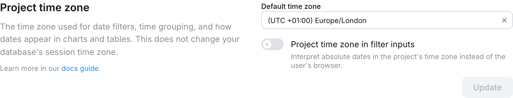
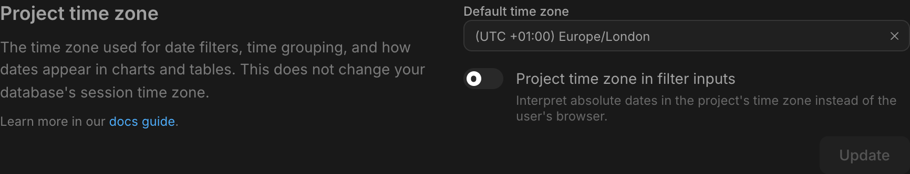
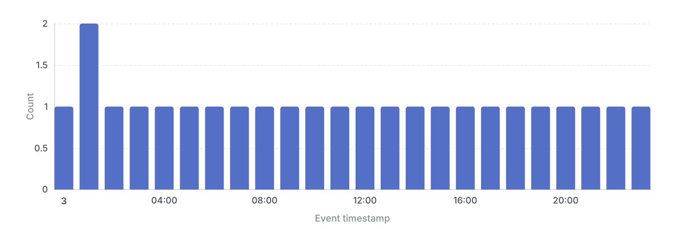
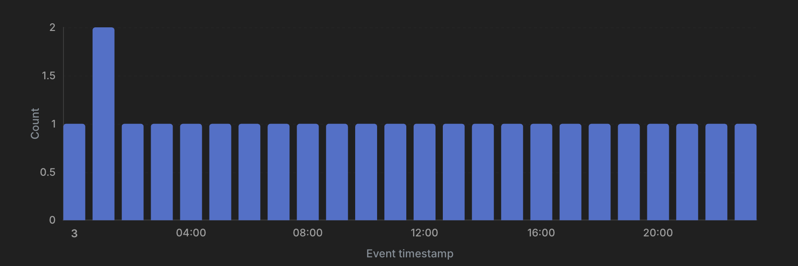
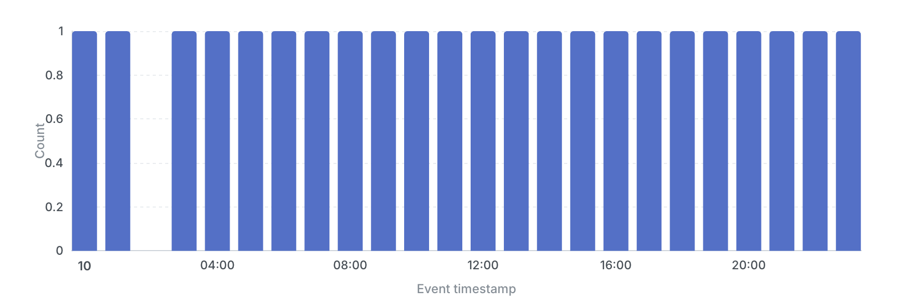
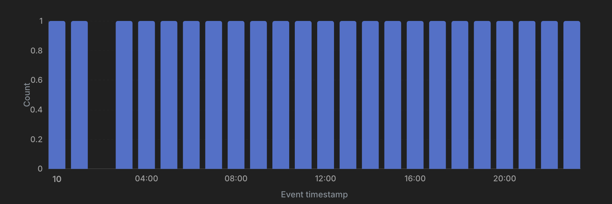

Lightdash converts timezones automatically once you tell it two things: what zone your raw data is stored in, and what zone you want reports in.

This guide is in two parts:

1. **[Setup](#setup)**: how to model your warehouse data and configure your project so timezones behave predictably.
2. **[Daily use](#daily-use)**: how filters, charts, sharing, and scheduling work once you're set up.

**The short version:** store timestamps as timezone-aware types, use `DATE` for calendar values, and set your project timezone to the zone you report in.

<Info>
  **Beta:** Timezone support is currently in the [Beta](/references/workspace/feature-maturity-levels) phase. Contact support to enable it for your organization.
</Info>

---

# Setup

## Data timezone vs Project timezone

| Setting | Answers | Where you set it |
| --- | --- | --- |
| **Data timezone** | "What zone is the raw data in?" | Warehouse connection settings |
| **Project timezone** | "What zone do my reports use?" | Project settings |

You set each one once, and every chart, filter, and export converts between the two automatically.

If all your raw data is UTC (recommended) and you report in your local zone, you only need to set the project timezone. The data timezone defaults to UTC.

## Pick the right column types in your warehouse

Store your event timestamps as **timezone-aware types**. They unambiguously identify a moment in time and require no extra configuration.

### Recommended by warehouse

| Warehouse | Use this | Avoid this |
| --- | --- | --- |
| Snowflake | `TIMESTAMP_LTZ` or `TIMESTAMP_TZ` | `TIMESTAMP_NTZ` for event data |
| BigQuery | `TIMESTAMP` | `DATETIME` for event data |
| Postgres / Redshift | `TIMESTAMP WITH TIME ZONE` (a.k.a. `timestamptz`) | `TIMESTAMP WITHOUT TIME ZONE` for event data |
| Databricks | `TIMESTAMP` | naive timestamps |
| DuckDB | `TIMESTAMPTZ` | naive `TIMESTAMP` for event data |

The "avoid" types are naive: they carry no timezone information, so Lightdash has to assume one (the data timezone you set on the connection).

### Use `DATE` for calendar values

If a column represents a calendar date rather than a moment in time, store it as `DATE`. Lightdash treats `DATE` columns as fixed calendar dates and never shifts them: `2024-03-15` stays `2024-03-15` regardless of the project timezone.

Use `DATE` for values like:

- A user's date of birth
- A subscription start date
- An anniversary
- A fiscal-period boundary

`DATE` is **not** what you want for event timestamps. If you store "the moment an order was placed" as a `DATE`, you lose the time-of-day and can't compute things like "orders per hour" later.

### Don't use strings for dates

`'2024-03-15'` as a `VARCHAR` is opaque to the warehouse and to Lightdash. Sorting breaks, ranges break, every operation needs a cast. Convert string columns in your dbt model to a proper `DATE` for calendar values, or `TIMESTAMP` when the value also carries a time of day.

## Configure your connection

When you create or edit a warehouse connection in Lightdash, you'll find a **Data timezone** field in Advanced settings.

<Frame>
  
  
</Frame>

- **If all your naive timestamps are in UTC** (very common, since most ELT pipelines normalize to UTC): leave it as UTC.
- **If your naive timestamps are in a single non-UTC zone** (e.g. an on-prem system that logs in local time): set the data timezone to that zone. Lightdash will interpret naive values as being in that zone.

After saving, click **Preview** to see how Lightdash interprets a sample timestamp. It shows the current moment in three forms: as your warehouse returns it, as Lightdash interprets it, and as it renders in your project timezone.

<Frame>
  
  
</Frame>

## Configure your project timezone

In Project settings → **Timezone**, pick the zone you want reports to use. This is the zone in which:

- "Today" and "yesterday" are computed.
- Bars on a daily chart are bucketed.
- Timestamps are displayed in tables, on chart axes, and in exports.

This does not control when scheduled deliveries are sent. That has its own [default time zone](/guides/how-to-create-scheduled-deliveries#configuring-the-default-time-zone) setting under Syncs & Scheduled Deliveries.

<Frame>
  
  
</Frame>

Common picks:

- The headquarters timezone for an internal-only org.
- The primary customer timezone for a regional business.
- **UTC** if you have a globally distributed team and want everyone to see the same numbers.

The project timezone is the default for every chart. If you don't set one, Lightdash uses UTC.

### Which timezone wins

A chart's own timezone setting decides what zone it uses, unless an embed overrides it. The zone it ends up using is its **resolved timezone**, the term used throughout this guide. From highest priority:

1. **A direct embed's `timezone` URL parameter** (on iframe or shareable-URL embeds only, see [Embedded dashboards](#embedded-dashboards)). This outranks everything.
2. Otherwise, the chart's timezone setting applies:
   - **Project timezone** (the default): the project's timezone, for every viewer.
   - **User timezone**: the viewer's profile timezone, or the project timezone if they haven't set one.
   - **A specific timezone**: that exact zone, the same for everyone.

See [Choosing a chart timezone](#choosing-a-chart-timezone) for how to set this.

## Opt a column out of timezone conversion

Most columns don't need annotations. The main exception is system or audit columns where you want the raw stored value displayed, with no shift to the project timezone:

<Tabs>
  <Tab title="dbt v1.9 and earlier">
    ```yaml
    columns:
      - name: created_at_utc
        meta:
          dimension:
            type: timestamp
            convert_timezone: false
    ```
  </Tab>
  <Tab title="dbt v1.10+ and Fusion">
    ```yaml
    columns:
      - name: created_at_utc
        config:
          meta:
            dimension:
              type: timestamp
              convert_timezone: false
    ```
  </Tab>
  <Tab title="Lightdash YAML">
    ```yaml
    dimensions:
      - name: created_at_utc
        type: timestamp
        convert_timezone: false
    ```
  </Tab>
</Tabs>

Use cases: audit logs, system timestamps, pre-converted values. The column renders exactly what the warehouse stores.

`DATE` columns need no annotation. If you declare a column as `type: date`, Lightdash treats it as a calendar value with no timezone applied, and renders it as-is.

## Naming conventions

Lightdash doesn't enforce naming, but consistent suffixes make a model easier to read:

- `..._at` for timezone-aware timestamps (e.g., `created_at`, `purchased_at`).
- `..._date` for calendar `DATE` columns (e.g., `signup_date`, `effective_date`).
- `..._at_utc` for columns you've explicitly marked `convert_timezone: false`.

## Verify before you build

Before building dashboards, run a quick smoke test:

1. Open Explore on a model with a known timestamp column.
2. Group by the dimension at "Day" granularity.
3. Compare a few rows against the raw warehouse data.

If the dates match what you'd expect for your project timezone, you're done. If not, the most common cause is the data timezone being set incorrectly on the connection. Check the connection preview.

## Calendar dates vs timestamps: what shifts

Whether a column moves with the chart's timezone depends on its type, not its name:

- **`TIMESTAMP`** columns identify a moment in time, so they shift into the resolved timezone.
- **`DATE`** columns are calendar values with no clock, so they never shift. `2024-03-15` stays `2024-03-15` for every viewer.

The same rule applies to a time interval built from a column. A day, week, or month grouping of a timestamp produces a calendar value, so its buckets move with the timezone. An hour-or-finer grouping stays a timestamp.

You can see which is which before you build. The dimension list shows an indicator next to each date and time dimension. Hover it for the detail:

| Dimension | Indicator | What it means |
| --- | --- | --- |
| Timestamp | Default icon, "Timestamp, shifts with the chart's timezone" | Renders in the resolved timezone. |
| Day-or-coarser interval of a timestamp | Default icon, "Calendar date, shifts with the chart's timezone" | Bucket boundaries move with the timezone. |
| `DATE` column | Calendar pin, "Calendar date, not affected by the chart's timezone" | Never shifts. |
| Timestamp with `convert_timezone: false` | Clock pin, "Timestamp shown as stored, not affected by the chart's timezone" | Shown exactly as stored. |

<Frame>
  
  
</Frame>

---

# Daily use

## The chart timezone badge

Every chart in Explore and on dashboards shows a small badge with its resolved timezone, for example `(UTC +01:00) Europe/London`. It's the zone the chart's filters, buckets, and values use, resolved by the rules in [Which timezone wins](#which-timezone-wins).

<Frame>
  
  
</Frame>

If it's not the zone you expect, change it with the [timezone picker](#choosing-a-chart-timezone).

## Choosing a chart timezone

Open the **Run query** settings (the dropdown next to the **Run query** button in Explore) and use the **Timezone** picker to choose how the chart resolves its zone. There are three options:

<Frame>
  
  
</Frame>

| Option | What viewers see | When to use |
| --- | --- | --- |
| **Project timezone** *(default)* | Everyone sees the project's timezone. If the project timezone changes later, the chart follows. | Shared reports and dashboards where the numbers should mean the same thing for everyone. |
| **User timezone** | Each viewer sees their own profile timezone, or the project timezone if they haven't set one. | Personal exploration, or internal dashboards where each viewer should see their own day boundaries. |
| **A specific timezone** | A fixed zone (e.g. `America/New_York`), the same for everyone, frozen regardless of project or viewer. | A chart that must always report in one zone, such as a regional report. |

**Project timezone** is the default, and it is not frozen at save time: it always resolves to the current project timezone, so a later change to the project setting flows through to the chart.

## How filters work

### Relative date filters

Relative filters like "yesterday," "last 7 days," and "this month" are computed in the chart's **resolved timezone**. On a chart resolved to America/New_York, "yesterday" is the day that just ended in New York.

### Absolute date filters

Absolute date filters (a specific date or range) are unambiguous. `2024-03-15` is `2024-03-15`, and behaves the same for every viewer.

Filters that include a time of day (for example "events after 9am on March 15") are more subtle. By default the datetime picker works in each viewer's browser timezone, so the same typed value can resolve to a different moment for different viewers.

To keep these filters consistent, a project admin can turn on **Project time zone in filter inputs** in Project settings → Timezone. Set a project timezone first; the toggle is disabled until one is set.

<Frame>
  
  
</Frame>

When it's on:

- The picker shows and interprets values in the project timezone, so the same typed value means the same moment for everyone.
- A line under the picker shows the equivalent local time, and a label shows the active timezone.
- Existing saved filters aren't rewritten. They keep the same moment, just shown in the new zone.

If a chart overrides its timezone with the [timezone picker](#choosing-a-chart-timezone), the filter inputs follow that override instead of the project timezone.

<Frame>
  
  
</Frame>

### Cell-click filters

Clicking a bar or cell filters on the value as shown, not the underlying instant. Click "March 2024" and you get March 2024 in the chart's timezone, exactly what you saw.

## Day-grouped vs hour-grouped charts

Day and hour groupings respond to timezone differently, which changes how charts look across viewers.

### Day-or-coarser grouping

A chart grouped by **day, week, month, quarter, or year** buckets data by calendar boundaries, so when the resolved timezone changes (for example on a User-timezone chart) those boundaries move and the same events can land in different bars. Two viewers can then see different numbers on the same daily chart. This is correct, since each sees their own calendar, but it can be surprising. See [Choosing a chart timezone](#choosing-a-chart-timezone) to control it.

### Sub-day grouping

A chart grouped by **hour, minute, or smaller** buckets data by instants. The boundaries are the same for every viewer; only the labels shift (your "9am EDT" is someone else's "2pm BST," but the bar contains the same events).

Sub-day grouping is consistent across viewers. The exception is half-hour and 45-minute offset zones (India, Nepal, parts of Australia), where bucket boundaries don't align with whole-hour zones.

## MIN/MAX date and timestamp metrics

A `min` or `max` metric renders by the type of the column it aggregates, following the same calendar-vs-instant rule as dimensions:

- **`DATE` column** (or a day-or-coarser date interval like `_month`): a plain calendar date at that grain, never shifted.
- **`TIMESTAMP` column**: shifted into the resolved timezone, like a timestamp dimension.

<Note>
Custom MIN/MAX metrics built in the Explore view pick this up automatically. Metrics defined in dbt or Lightdash YAML need a project recompile (Refresh dbt or `lightdash deploy`) before the new formatting applies.
</Note>

## Daylight-saving transitions

Lightdash buckets data by local time in the resolved timezone, so daylight-saving transitions show up in your charts.

- On a **daily** chart, the fall-back day spans 25 hours and the spring-forward day spans 23. Each bar still counts exactly the events in that calendar day, and drilling in returns them all.
- On an **hourly** chart, the two 1 AM hours on the fall-back day merge into a single bar with double the count, and the missing 2 AM hour on the spring-forward day simply has no bar.

The hourly charts below count one event per hour in America/New_York. On the fall-back day (3 November), every hour has one event except 1 AM, which holds two: summer-time 1 AM and winter-time 1 AM land in the same bar.

<Frame>
  
  
</Frame>

On the spring-forward day (10 March), the clocks jump from 2 AM to 3 AM, so the 2 AM bar is missing entirely.

<Frame>
  
  
</Frame>

## Your profile timezone

In your Profile settings, you can set a **Default timezone**. It affects only charts set to **User timezone**, which resolve to your profile zone when you view them.

It does **not** affect:

- Charts set to **Project timezone** or to a specific timezone.
- Embedded dashboards (an embed has no viewer profile to read).

If you don't set a profile timezone, charts in User timezone mode fall back to the project timezone.

Scheduled deliveries are the exception to "no viewer": a delivery runs its queries as the person who created it, so a User-timezone chart in a delivery uses the creator's profile timezone, not each recipient's.

## Dashboards

Every chart on a dashboard keeps its own timezone setting, so one dashboard can mix Project-timezone charts (same for everyone) with User-timezone charts (per viewer). Each chart's badge shows the zone it resolved to.

A dashboard date filter sends the same value to every chart, but each chart reads it in its own zone. So a "last 7 days" filter can cover a different window on a Project-timezone chart than on the User-timezone chart next to it.

## Scheduled deliveries

Scheduled reports have two independent timezone settings:

| Setting | Controls | Example |
| --- | --- | --- |
| **Delivery time** | When the report fires | "Send at 9am every Monday" uses the delivery timezone |
| **Chart data** | What "yesterday" / "last week" mean in the report | "Last 7 days" uses each chart's resolved timezone |

The two don't have to match. A delivery scheduled for "9am New York" can contain a chart in UTC: the report fires at 9am New York and shows UTC-bucketed data.

For most schedules, the cleanest setup is:

- **Delivery time** in the recipient's working timezone (so the report arrives at a useful hour).
- **Chart data** on the project timezone (so the numbers are consistent and explicable).

## Embedded dashboards

An embedded dashboard has no signed-in viewer, so there's no profile timezone to read. Its zone resolves one of two ways:

- **A `timezone` URL parameter** sets one zone for the whole session and overrides every chart. Available on direct iframe and shareable-URL embeds only, not the React SDK. See [embedding URL parameters](/references/iframe-embedding#timezone).
- **Otherwise**, each chart uses its own setting: the project timezone, or a specific zone if one was pinned. A User-timezone chart falls back to the project, since there's no profile to read.

## When things go wrong

A few common symptoms and where to look:

| Symptom | Likely cause | Where to check |
| --- | --- | --- |
| Two viewers see different numbers on the same chart | Chart is set to User timezone | The badge on the chart; switch it to Project timezone if you want everyone to match |
| A daily chart shows a partial bar for "today" that the author didn't see | User timezone mode, with a viewer further west than the author | Same as above |
| All timestamps are off by an hour or several hours | Data timezone is set wrong on the connection | Project settings → Connection → Data timezone preview |
| Times in a CSV export differ from times in the Lightdash UI | Export was taken with a different chart timezone | Re-export from a chart in the desired zone |
| "Yesterday" filter returns no data, but yesterday clearly has data | Project timezone is set to a zone where "yesterday" hasn't started yet | Project settings → Timezone |
| Hourly chart looks like it skipped or doubled an hour | Daylight-saving transition in the rendered period | Switch to UTC to confirm |

If you're stuck, check the chart's badge and the connection's data-timezone preview first; both show exactly what Lightdash is using.

---

# Example: one row, four configurations

Imagine one row in your `orders` table:

| Column | Type | Stored value |
| --- | --- | --- |
| `order_date` | `DATE` | `2026-05-19` |
| `order_created_at` | `TIMESTAMP` (UTC) | `2026-05-19 02:00:00 UTC` |

Same row, same warehouse. Here's what changes as you layer settings on.

| Configuration | `order_created_at` shows | Grouped by day | `order_date` shows | Same for every viewer? |
| --- | --- | --- | --- | --- |
| Project timezone `UTC` | `2026-05-19 02:00` | `2026-05-19` | `2026-05-19` | Yes |
| Project timezone `America/New_York` | `2026-05-18 22:00` | `2026-05-18` | `2026-05-19` | Yes |
| One chart pinned to `Asia/Tokyo` (project stays NY) | `2026-05-19 11:00` | `2026-05-19` | `2026-05-19` | Yes on that chart, but the dashboard now mixes zones |
| Chart set to User timezone | the viewer's local time | the viewer's local day | `2026-05-19` | No, each viewer sees their own day |

---

**The pattern.** Timestamp rendering and bucketing shift with the resolved zone. DATE values never shift. But anything derived from "now" (relative filters) always uses the resolved zone, regardless of column type.
