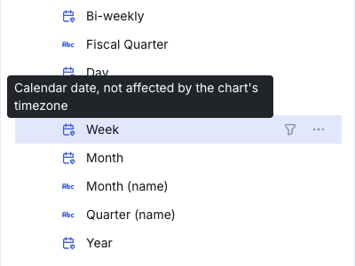
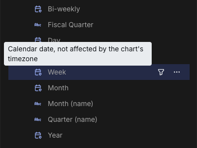
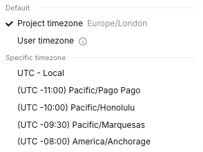
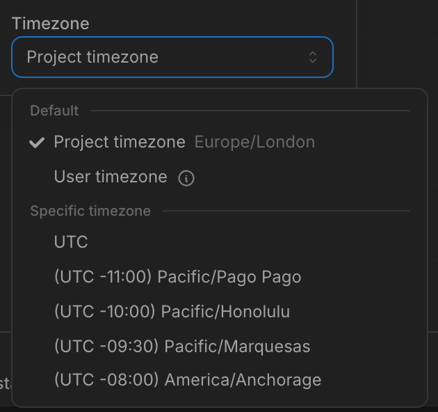

Lightdash handles timezones for you, but it can only do that well if you tell it two things: what your raw data means, and what timezone you want your reports in. Get those right and the rest is automatic.

This guide is in two parts:

1. **Setup**: how to model your warehouse data and configure your project so timezones behave predictably.
2. **Daily use**: how filters, charts, sharing, and scheduling work once you're set up.

If you only read one thing: set your project timezone to the zone you actually report in, store timestamps as timezone-aware types in your warehouse, and use `DATE` for calendar values. The rest is detail.

<Note>
Timezone support is enabled per organization. If the chart timezone picker, the resolved-timezone badge, or the dimension indicators described below aren't visible in your instance, ask your Lightdash admin to turn on timezone support.
</Note>

---

# Part 1: Setup

## Two timezones, one mental model

| Setting | Answers | Where you set it |
| --- | --- | --- |
| **Data timezone** | "What zone is the raw data in?" | Warehouse connection settings |
| **Project timezone** | "What zone do my reports use?" | Project settings |

You set each one once. From then on, every chart, filter, and export converts between the two automatically.

If all your raw data is UTC (recommended) and you report in your local zone, you only need to set the project timezone. The data timezone defaults to UTC.

## Pick the right column types in your warehouse

The single highest-leverage thing you can do for clean timezone behavior is store your timestamps as **timezone-aware types**. They unambiguously identify a moment in time and require no extra configuration.

### Recommended by warehouse

| Warehouse | Use this | Avoid this |
| --- | --- | --- |
| Snowflake | `TIMESTAMP_LTZ` or `TIMESTAMP_TZ` | `TIMESTAMP_NTZ` for event data |
| BigQuery | `TIMESTAMP` | `DATETIME` for event data |
| Postgres / Redshift | `TIMESTAMP WITH TIME ZONE` (a.k.a. `timestamptz`) | `TIMESTAMP WITHOUT TIME ZONE` for event data |
| Databricks | `TIMESTAMP` | naive timestamps |
| DuckDB | `TIMESTAMPTZ` | naive `TIMESTAMP` for event data |

The "avoid" types aren't broken, they're just naive. They don't carry timezone information, so Lightdash has to assume something about them: the data timezone you set on the connection.

### Use `DATE` for calendar values

If a column represents a calendar date, such as a birthday, a fiscal period start, or an `effective_date` on a contract, store it as `DATE`. Lightdash treats `DATE` columns as wall-clock values and never shifts them. No matter the project timezone, `2024-03-15` stays `2024-03-15`.

This is what you want for things like:

- A user's date of birth
- A subscription start date
- An anniversary
- A fiscal-period boundary

This is **not** what you want for event timestamps. If you store "the moment an order was placed" as a `DATE`, you lose the time-of-day and can't compute things like "orders per hour" later.

### Don't use strings for dates

`'2024-03-15'` as a `VARCHAR` is opaque to the warehouse and to Lightdash. Sorting breaks, ranges break, every operation needs a cast. If you have string dates, convert them to proper `DATE` or `TIMESTAMP` types in your dbt model.

## Configure your connection

When you create or edit a warehouse connection in Lightdash, you'll find a **Data timezone** field in Advanced settings.

<Frame>
  
  
</Frame>

- **If all your naive timestamps are in UTC** (very common, since most ELT pipelines normalize to UTC): leave it as UTC.
- **If your naive timestamps are in a single non-UTC zone** (e.g. an on-prem system that logs in local time): set the data timezone to that zone. Lightdash will interpret naive values as being in that zone.

After saving, click **Preview** to see how Lightdash interprets a sample timestamp. The preview shows the current moment in three forms: as your warehouse returns it, as Lightdash interprets it, and as it would render in your project timezone. If those three values agree with what you expect, you're set.

<Frame>
  
  
</Frame>

## Configure your project timezone

In Project settings → **Timezone**, pick the zone you want reports to use. This is the zone in which:

- "Today" and "yesterday" are computed.
- Bars on a daily chart are bucketed.
- Scheduled deliveries are aligned (e.g., "send at 9am").

<Frame>
  
  
</Frame>

Common picks:

- The headquarters timezone for an internal-only org.
- The primary customer timezone for a regional business.
- **UTC** if you have a globally distributed team and want everyone to see the same numbers.

The project timezone is the default for every chart. If you don't set one, Lightdash uses UTC.

### Which timezone wins

A chart's own timezone setting decides what zone it uses, unless an embed overrides it. From highest priority:

1. **An embed URL timezone parameter**, if the chart is embedded with one. This outranks everything.
2. Otherwise, the chart's timezone setting applies:
   - **Project timezone** (the default): the project's timezone, for every viewer.
   - **User timezone**: the viewer's profile timezone, or the project timezone if they haven't set one.
   - **A specific timezone**: that exact zone, the same for everyone.

See [Choosing a chart's timezone](#choosing-a-charts-timezone) in Part 2 for how to set this.

## Annotate edge-case columns in your dbt model

Most columns don't need annotations. The main exception is system or audit columns where you want the raw stored value displayed, with no shift to the project timezone:

```yaml
columns:
  - name: created_at_utc
    meta:
      dimension:
        type: timestamp
        convert_timezone: false
```

Use cases: audit logs, system timestamps, pre-converted values. The column renders exactly what the warehouse stores.

`DATE` columns need no annotation. If you declare a column as `type: date`, Lightdash treats it as a calendar value with no timezone applied, and renders it as-is.

## Naming conventions

A small habit that pays off:

- `..._at` for timezone-aware timestamps (e.g., `created_at`, `purchased_at`).
- `..._date` for calendar `DATE` columns (e.g., `signup_date`, `effective_date`).
- `..._at_utc` for columns you've explicitly marked `convert_timezone: false`.

Lightdash doesn't enforce this, but it helps anyone reading your model know what to expect.

## Verify before you build

Before building dashboards, run a quick smoke test:

1. Open Explore on a model with a known timestamp column.
2. Group by the dimension at "Day" granularity.
3. Compare a few rows against the raw warehouse data.

If the dates match what you'd expect for your project timezone, you're done. If not, the most common cause is the data timezone being set incorrectly on the connection. Check the connection preview.

## Calendar dates vs timestamps: what shifts

Whether a column moves with the chart's timezone depends on its type, not its name:

- **Timestamp** columns identify a moment in time, so they shift into the resolved timezone.
- **`DATE`** columns are calendar values with no clock, so they never shift. `2024-03-15` stays `2024-03-15` for every viewer.

The same rule applies to a time interval built from a column. A day, week, or month grouping of a timestamp produces a calendar value, so its buckets move with the timezone. An hour-or-finer grouping stays a timestamp.

You can see which is which before you build. The dimension list shows an indicator next to each date and time dimension. Hover it for the detail:

| Dimension | Indicator | What it means |
| --- | --- | --- |
| Timestamp | Default icon, "Timestamp, shifts with the chart's timezone" | Renders in the resolved timezone. |
| Day-or-coarser interval of a timestamp | Default icon, "Calendar date, shifts with the chart's timezone" | Bucket boundaries move with the timezone. |
| `DATE` column | Calendar pin, "Calendar date, not affected by the chart's timezone" | Never shifts. |
| Timestamp with `convert_timezone: false` | Clock pin, "Timestamp shown as stored, not affected by the chart's timezone" | Shown exactly as stored. |

<Frame>
  
  
</Frame>

---

# Part 2: Daily use

## The chart timezone badge

Every chart in Explore and on dashboards shows a small badge with the resolved timezone, for example `(UTC +01:00) Europe/London`. This tells you exactly what zone the chart's filters, buckets, and rendered values are using.

<Frame>
  
  
</Frame>

Read it. If it's not what you expect, use the timezone picker to change the chart's timezone (see [Choosing a chart's timezone](#choosing-a-charts-timezone)).

## How filters work

### Relative date filters

Filters like "last 7 days," "yesterday," and "this month" are computed in the **resolved timezone of the chart**. That means:

- "Yesterday" on a chart in America/New_York means the calendar day that just ended in New York.
- "Last 7 days" means the rolling 7-day window ending at the current moment, with day boundaries in New York.
- "This month" means the calendar month in New York.

### Absolute date filters

Absolute date filters (a specific date or range) are unambiguous. `2024-03-15` is `2024-03-15`, and behaves the same for every viewer.

Filters that include a time of day (for example "events after 9am on March 15") are more subtle. By default the datetime picker works in each viewer's browser timezone, so the same typed value can resolve to a different moment for different viewers.

To keep these filters consistent, a project admin can turn on **Use project time zone in date filter inputs** in Project settings → Timezone. Set a project timezone first; the toggle is disabled until one is set. When it's on:

- The picker shows and interprets values in the project timezone, so the same typed value means the same moment for everyone.
- A line under the picker shows the equivalent local time, and a label shows the active timezone.
- Existing saved filters aren't rewritten. They keep the same moment, just shown in the new zone.

If a chart overrides its timezone with the [timezone picker](#choosing-a-charts-timezone), the filter inputs follow that override instead of the project timezone.

<Frame>
  
  
</Frame>

### Cell-click filters

Clicking a bar or cell to filter ("show me only this month") uses the value as displayed, not the underlying instant. Click "March 2024" and you filter to March 2024 in the chart's timezone, which is exactly what you saw.

## Day-grouped vs hour-grouped charts

This is the one subtlety worth understanding, because it affects how charts look across viewers in different timezones.

### Day-or-coarser grouping

A chart grouped by **day, week, month, quarter, or year** buckets data by calendar boundaries. If the chart's resolved timezone changes, for example because a viewer is using User timezone mode, the bucket boundaries move. The same underlying events can land in different bars.

**Implication:** two viewers in different timezones may see different numbers on a daily chart if the chart is set to User timezone. This is correct (each viewer is seeing their own calendar) but can be surprising. See [Choosing a chart's timezone](#choosing-a-charts-timezone) for how to control this.

### Sub-day grouping

A chart grouped by **hour, minute, or smaller** buckets data by instants. The boundaries are the same for every viewer; only the labels shift (your "9am EDT" is someone else's "2pm BST," but the bar contains the same events).

**Implication:** sub-day grouping is naturally consistent across viewers. The one exception is half-hour and 45-minute offset zones (India, Nepal, parts of Australia), where bucket boundaries don't align with whole-hour zones.

## MIN/MAX date and timestamp metrics

A `min` or `max` metric renders by the type of the column it aggregates, following the same calendar-vs-instant rule as dimensions:

- **`DATE` column** (or a day-or-coarser date interval like `_month`): a plain calendar date at that grain, never shifted.
- **`TIMESTAMP` column**: shifted into the resolved timezone, like a timestamp dimension.

<Note>
Custom MIN/MAX metrics built in the Explore view pick this up automatically. Metrics defined in dbt or Lightdash YAML need a project recompile (Refresh dbt or `lightdash deploy`) before the new formatting applies.
</Note>

## Daylight-saving transitions

Lightdash buckets data by wall-clock time in the resolved timezone, so daylight-saving transitions show up in your charts.

- On a **daily** chart, the fall-back day holds 25 hours of events and the spring-forward day holds 23, so that bar is slightly taller or shorter than its neighbours. Drilling into a day always returns exactly its events.
- On an **hourly** chart, the two 1 AM hours on the fall-back day merge into a single bar with double the count, and the missing 2 AM hour on the spring-forward day simply has no bar.

This matches how other BI tools plot the transition. If a one-hour jump looks suspicious, switch the chart to UTC to confirm it's a daylight-saving artifact and not a data issue.

## Choosing a chart's timezone

Open the timezone picker from the chart's settings (next to **Run query** in Explore) to choose how the chart resolves its zone. There are three options:

<Frame>
  
  
</Frame>

| Option | What viewers see | When to use |
| --- | --- | --- |
| **Project timezone** *(default)* | Everyone sees the project's timezone. If the project timezone changes later, the chart follows. | Shared reports and dashboards where the numbers should mean the same thing for everyone. |
| **User timezone** | Each viewer sees their own profile timezone, or the project timezone if they haven't set one. | Personal exploration, or internal dashboards where each viewer should see their own day boundaries. |
| **A specific timezone** | A fixed zone (e.g. `America/New_York`), the same for everyone, frozen regardless of project or viewer. | A chart that must always report in one zone, such as a regional report. |

The default is **Project timezone**. It is not pinned to whatever zone you happened to be in when you saved: it always resolves to the current project timezone, so the chart stays consistent for its whole audience and tracks any later change to the project setting. Pick **User timezone** only when you deliberately want each viewer's own day boundaries, and **A specific timezone** when the zone must never change.

## Your profile timezone

In your Profile settings, you can set a **Default timezone**. It only takes effect when timezone support is enabled for your organization, and it only affects charts set to **User timezone**: those charts resolve to your profile timezone when you view them.

It does **not** affect:

- Charts set to **Project timezone** or to a specific timezone.
- Embeds and scheduled deliveries (these have no viewer to read a profile from).

If you don't set a profile timezone, charts in User timezone mode fall back to the project timezone.

## Dashboards

Each chart on a dashboard keeps its own timezone setting. A dashboard can mix charts on the project timezone (consistent across viewers) with charts on User timezone (varies per viewer). Each chart's badge tells you which zone it resolved to.

Dashboard-level date filters (e.g., a date picker that controls multiple charts) pass the same value to every chart, but each chart applies its own timezone logic. So a dashboard filter "last 7 days" on a Project-timezone chart and a User-timezone chart can produce different numbers: one is anchored to the project zone, the other to the viewer's zone.

## Scheduled deliveries

Scheduled reports have two independent timezones, and it's worth understanding which is which:

| Setting | Controls | Example |
| --- | --- | --- |
| **Delivery time** | When the report fires | "Send at 9am every Monday" uses the delivery timezone |
| **Chart data** | What "yesterday" / "last week" mean in the report | "Last 7 days" uses each chart's resolved timezone |

The two don't have to match. A delivery scheduled for "9am New York" can contain a chart in UTC: the report fires at 9am New York and shows UTC-bucketed data.

For most schedules, the cleanest setup is:

- **Delivery time** in the recipient's working timezone (so the report arrives at a useful hour).
- **Chart data** on the project timezone (so the numbers are consistent and explicable).

## Embedded charts

When you embed a Lightdash chart in another product, the embed has no user, so there's no profile timezone to fall back to. Embedded charts use:

1. The embed URL's timezone parameter, if one is set.
2. Otherwise, the chart's own setting (project timezone, or a specific timezone if chosen).

If you need an embed in a specific zone, set the chart to that specific timezone, or pass the timezone parameter in the embed URL.

## When things go wrong

A few common symptoms and where to look:

| Symptom | Likely cause | Where to check |
| --- | --- | --- |
| Two viewers see different numbers on the same chart | Chart is set to User timezone | The badge on the chart; switch it to Project timezone if you want everyone to match |
| A daily chart shows a partial bar for "today" that the author didn't see | User timezone mode, with a viewer further west than the author | Same as above |
| All timestamps are off by an hour or several hours | Data timezone is set wrong on the connection | Project settings → Connection → Data timezone preview |
| Times in a CSV export differ from times in the Lightdash UI | Export was taken with a different chart timezone | Re-export from a chart in the desired zone |
| "Yesterday" filter returns no data, but yesterday clearly has data | Project timezone is set to a zone where "yesterday" hasn't started yet | Project settings → Timezone |
| Hourly chart looks like it skipped or doubled an hour | Daylight-saving transition in the rendered period | Switch to UTC to confirm |

If you're stuck, the badge on the chart and the data-timezone preview on the connection page are the two fastest checks. They tell you exactly what Lightdash is using.

---

## TL;DR checklist

**Modeling:**

- [ ] Use timezone-aware timestamp types in your warehouse.
- [ ] Use `DATE` for calendar values, not strings, not timestamps.
- [ ] Set the connection's data timezone (default UTC is usually right).
- [ ] Set the project timezone to your reporting zone.
- [ ] Add `convert_timezone: false` only on columns you want shown raw.

**Day-to-day:**

- [ ] When saving a chart, leave it on Project timezone (default) unless you have a reason to change it.
- [ ] Read the badge on the chart: it tells you the resolved zone.
- [ ] Set your profile timezone once if you work with User-timezone charts.
- [ ] Use a specific timezone for charts that must always report in one zone.

---

# Appendix: Worked example: one row, four configurations

Imagine one row in your `orders` table:

| Column | Type | Stored value |
| --- | --- | --- |
| `order_date` | `DATE` | `2026-05-19` |
| `order_created_at` | `TIMESTAMP` (UTC) | `2026-05-19 02:00:00 UTC` |

Same row, same warehouse. Here's what changes as you layer settings on.

### 1. Out of the box: project timezone = UTC, all charts on Project timezone

- `order_created_at` renders as `2026-05-19 02:00`. Grouped by day, it lands in bucket `2026-05-19`.
- `order_date` renders as `2026-05-19`.
- "Yesterday" filter on either column is `2026-05-18`.
- Every viewer, everywhere, sees the same thing.

### 2. Change the project timezone to America/New_York

- `order_created_at` now renders as `2026-05-18 22:00` (the same instant, shown in NY). Grouped by day, it lands in bucket `2026-05-18`. The row moved buckets.
- `order_date` still renders as `2026-05-19`. **DATE columns don't shift.**
- "Yesterday" on `order_created_at` is the calendar day that ended in NY, `2026-05-18`.
- "Yesterday" on `order_date` is also `2026-05-18` (the literal is computed in NY, but compared as a plain date).
- Still identical for every viewer.

### 3. Set one chart to a specific timezone (Asia/Tokyo); project remains NY

- On that chart: `order_created_at` renders as `2026-05-19 11:00 JST`, bucket `2026-05-19`. `order_date` is still `2026-05-19`.
- On every other chart in the project: still the NY behaviour from step 2.
- All viewers see the same numbers on each chart, but the dashboard now mixes zones. Each chart's badge tells viewers which zone it's in.

### 4. Set a chart to User timezone; viewer A is in London, viewer B in Tokyo

- Viewer A sees `order_created_at` in London time; "yesterday" is the day that ended in London.
- Viewer B sees the same column in Tokyo time; "yesterday" is the day that ended in Tokyo.
- Around midnight in either zone, the same row can land in a different daily bucket for A vs B, and "yesterday" can resolve to different dates. Two viewers, same chart, different numbers.
- `order_date` is unaffected by the viewer's zone for rendering: both see `2026-05-19`. But "yesterday" on `order_date` still depends on whose calendar "now" we use, so the filter result can differ.

---

**The pattern.** Timestamp rendering and bucketing shift with the resolved zone. DATE values never shift. But anything derived from "now" (relative filters) always uses the resolved zone, regardless of column type.
