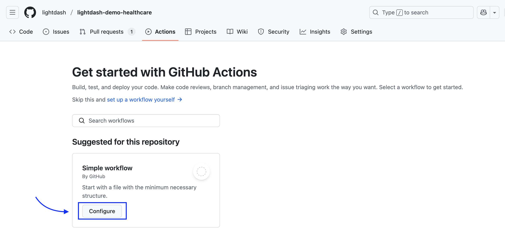
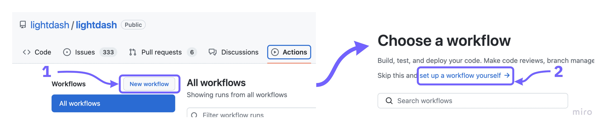
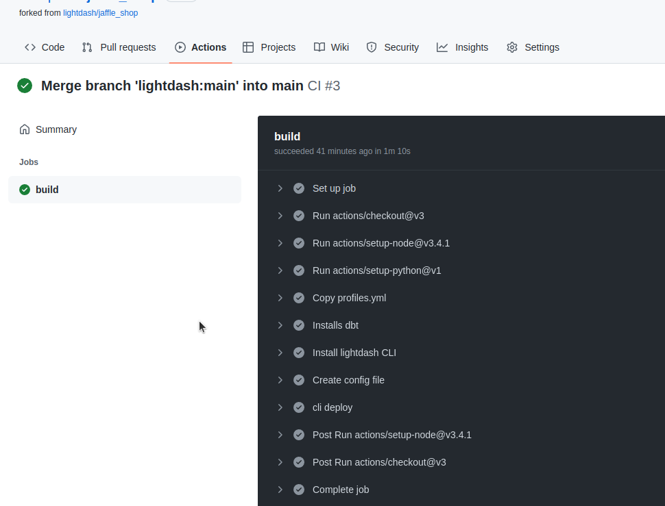

import StrictCompilationFlags from '/snippets/strict-compilation-flags.mdx';

Adding this Lightdash compile action will compile your dbt project's .yml files and check to see if there are any errors that will break your Lightdash project. For example, a metric that references a dimension that doesn't exist.

## Choose partial or strict compilation

<StrictCompilationFlags />

For a CI check that reports the isolated failures as errors, use strict compilation:

```bash
lightdash compile --no-partial-compilation
```

Combine it with warehouse-column validation when your project uses physical references:

```bash
lightdash compile --no-partial-compilation --validate-warehouse-columns
```

## Add credentials to GitHub secrets

The compile action authenticates with Lightdash and your warehouse using GitHub secrets. Set them up once by following [Add credentials to GitHub secrets](/workflow/set-up-ci-cd#add-credentials-to-github-secrets) — the same secrets work for every Lightdash CI workflow.

## Create the compile workflow

Go to your repo, click on `Actions` menu.

If you don't have any GitHub actions, you'll just need to click on `Configure`
<Frame>
  
</Frame>

If you have some GitHub actions in your repo already, click on `New workflow`, then select `setup a workflow yourself`.

<Frame>
  
</Frame>

Now copy [this compile.yml file](https://github.com/lightdash/cli-actions/blob/main/compile.yml) from our [cli-actions](https://github.com/lightdash/cli-actions) repo.

<Info>
If you only use a subset of your dbt models in Lightdash, then you'll want to specify that subset in your file [here](https://github.com/lightdash/cli-actions/blob/d91de777ed3668b537acd141b734eca75def4e52/compile.yml#L65).

  For example, to only compile models with the tag `lightdash`, you would change this line to: `run: lightdash compile --select tag:lightdash --project-dir "$PROJECT_DIR" --profiles-dir . --profile prod || lightdash compile --select tag:lightdash --project-dir "$PROJECT_DIR" --profiles-dir .`
</Info>

Give it a nice name like `compile-lightdash.yml`

And commit this to your repo by clicking on `Start commit`.

## You're done!

Everytime you open a new pull request on the repository that contains your Lightdash project, `lightdash compile` will run and check to see if any of the changes you made will break your Lightdash instance.

You can see the log on the `Github actions` page

<Frame>
  
</Frame>
