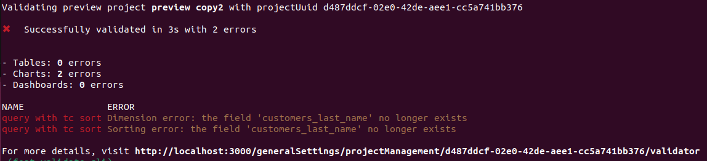
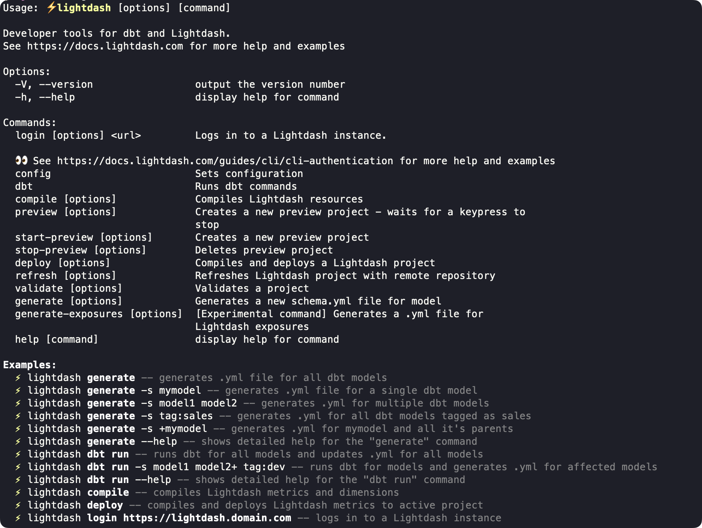

import StrictCompilationFlags from '/snippets/strict-compilation-flags.mdx';

You can trigger a validation on a project using the Lightdash CLI so you can check locally if your changes will break anything. You can also add `lightdash validate` to your [GitHub Actions](#configure-github-actions) so changes can't be merged unless they pass the validation. For what the validator checks and every way it runs, see [Validating your content](/workflow/validating-your-content).

## Usage

<Frame>
  
</Frame>

### Validate your changes against your project by running lightdash validate

You can run `lightdash validate` to check if your changes break any of the content in production. By default, `lightdash validate` will check your changes against the content in the project you've selected on the CLI. You can change your project using `lightdash config set-project`.

```bash
lightdash validate
```

Optionally you can use the `--preview` argument to validate your last preview environment created from the CLI.

You will get a list of errors if your local files are going to break some content on your project. These errors will not be reflected on the validation table on Lightdash settings.

### Validate any project using the project UUID

You can run a validation on any project by specifying the project UUID in the `lightdash validate` command.

```bash
lightdash validate --project <project uuid>
```

**Note:** you can get your project UUID from the Lightdash URL by selecting the ID after the `projects/`

<Frame>
  
</Frame>

### Validate only specific elements of your project

You can select which parts of your project you would like to validate using the `--only` argument.

```bash
lightdash validate --only tables charts dashboards
```

Available options:

* `tables`

* `charts`

* `dashboards`

### Use strict compilation

<StrictCompilationFlags />

Combine both flags for the strictest check:

```bash
lightdash validate --validate-warehouse-columns --no-partial-compilation
```

`lightdash validate` includes `tables` by default, so the warehouse-column check runs without extra options and table model errors make the command exit non-zero. If you customize `--only`, keep `tables` in the list to run the warehouse check; use `--only tables` to validate tables without charts or dashboards.

The check requires warehouse credentials and the warehouse catalog, and is skipped for dbt Cloud CLI and Lightdash YAML-only compilation. See the [CLI reference](/workflow/cli/reference#validate-physical-warehouse-columns) for supported reference syntax and all skip conditions.

## Configure Github actions

This command will create a preview environment, and then validate this preview by specifying `--preview` on the validate command.`lightdash validate` will return an error (return code 1) if there is at least 1 validation error on your project. You can use this output to block a deploy on Github actions like this

```yaml
- name: Start preview
  run: lightdash start-preview
- name: Validate preview
  run: lightdash validate --preview
```

To learn more about setting up GitHub Actions for Lightdash, see [Automate with CI/CD](/workflow/set-up-ci-cd).