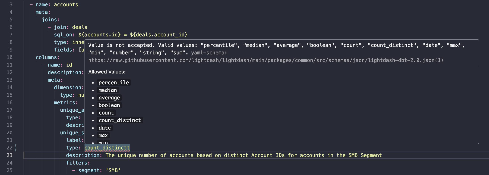

## YAML validation

If you use VS Code to make edits to your dbt project, we recommend setting up Lightdash YAML validation. The validator will flag any formatting or configuration issues before compiling your project, so you can fix issues faster.

The validation uses the same logic that Lightdash uses when compiling your project.

All you have to do is add this snippet to your `settings.json` file in VS Code. [Read this guide](https://code.visualstudio.com/docs/getstarted/settings#%5Fsettings-json-file) to details on how to edit your `settings.json`.

```json
    "yaml.schemas": {
        "https://raw.githubusercontent.com/lightdash/lightdash/main/packages/common/src/schemas/json/lightdash-dbt-2.0.json": [
            "/**/models/**/*.yml",
            "/**/models/**/*.yaml"
        ]
    },
```

You'll also need to [install the YAML VS Code extension](https://marketplace.visualstudio.com/items?itemName=redhat.vscode-yaml) for validation to work.

Once you have the extension installed and settings updated, you'll see warnings like this when working on your `schema.yml` files.

<Frame>
  
</Frame>
