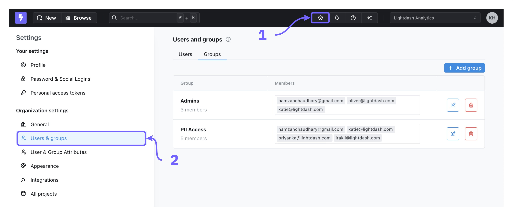

<Info>
  **Groups are only available on Lightdash Enterprise plans.**

  For more information on our plans, visit our [pricing page](https://www.lightdash.com/pricing).
</Info>

<Warning>
  **Self-hosted users:** You must set the `GROUPS_ENABLED` environment variable to `true` for groups to be visible in the UI. Without this, the Groups option won't appear in the sidebar, even if you have an admin role. See the [environment variables reference](/self-host/customize-deployment/environment-variables) for more details.
</Warning>

To view and manage your groups, go to the `Organization Settings` \> `Users & groups` tab. Only users with an `organization admin` role can manage groups.

<Frame>
  
</Frame>

## Creating groups

To create a new group, go to `Organization Settings` \> `Users & groups` \> `Add group`. You can name your group and add users in your organization to the group. By default, newly created groups don’t have access to anything.

## Editing groups

To edit a group, click on the edit button to the right of a group in the list. You can add or remove users from a group and change the group name.

To remove someone from that group, click on the `x` to the right of the group member.

## Deleting groups

To delete a group, click the delete icon to the right of a group in the list to remove it.

## Adding roles to groups

To assign a role to a group, use the `Project access` page in the `Organization settings` menu. From there, you can assign a group or groups to a role which determines their access to the project. For more information, see the [Project roles](/workspace-admin/roles#project-roles-and-permissions) page.

## Assigning user attributes to groups

You can assign user attributes to groups as well as individual users. To learn more about managing data access for groups using user attributes, check out the [user attributes docs here](/workspace-admin/user-attributes#assigning-user-attributes-to-users-and-groups).

## Provisioning groups from your identity provider

To sync users and their group memberships from your identity provider, use [SCIM group role provisioning](/workspace-admin/sso/scim#group-role-provisioning).