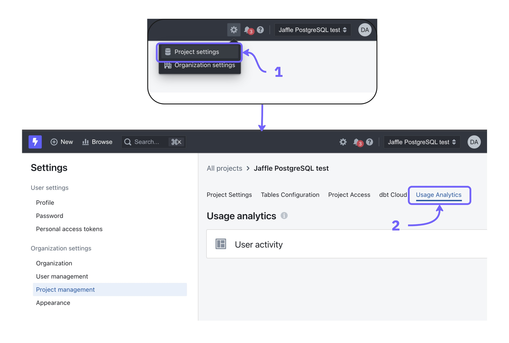
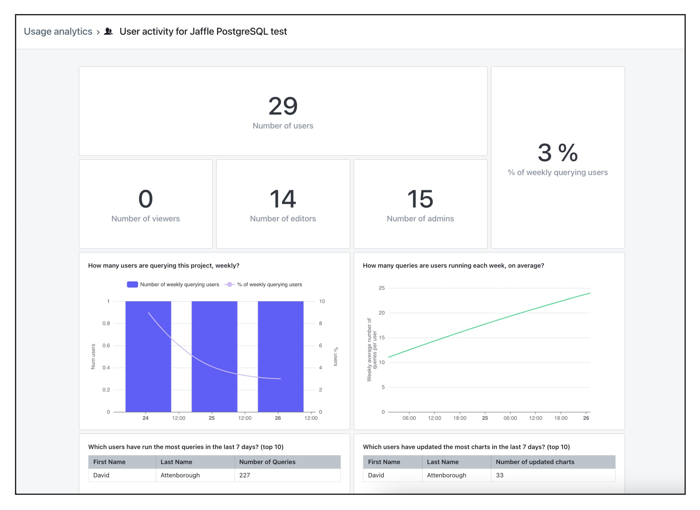

There are two ways of understanding user activity:

1. [**Usage Analytics dashboards**](#usage-analytics-dashboards) - these are dashboards created by Lightdash which give you an overview of your project's content and user activity.
2. [**Query tags**](#query-tags) - this is metadata which is added to your data warehouse queries and gives you information about who is querying data and what they are querying.

## Usage analytics dashboards

Each project has usage analytics dashboards created by Lightdash giving you an overview of your project's content and user activity.

To see your usage analytics dashboards for a project, just click on the `settings` icon, `project settings`, then `usage analytics`.

<Frame>
  
</Frame>

Or you can also use our [search bar](/explore/search) to get direct access to the different analytics dashboards by typing the name of the dashboard (eg: User activity)

### User Activity dashboard

This dashboard gives you an overview of the users in your project and the activity of your users.

<Frame>
  
</Frame>

Here's an overview of the fields used in the dashboard:

- **Number of users**: the total number of users that have access to the project.
- **Number of viewers**: the number of users with the `viewer` role that have access to the project.
- **Number of editors**: the number of users with the `editor` role that have access to the project.
- **Number of admins**: the number of users with the `admin` role that have access to the project.
- **% of weekly querying users**: the % of users which have run at least one query in the project in the last 7 days (out of all users in your project). Queries include viewing existing charts and dashboards.
- **Number of weekly querying users**: the number of users which have run at least one query in the project in the last 7 days.
- **Weekly average number of queries per user**: the rolling 7 day average number of queries that each user is running in your project.
- **Users that have run the most queries in the last 7 days**: a list of the users that have run the most queries in your project in the last 7 days.
- **Users that have updated the most charts in the last 7 days**: a list of users that have updated (including created) the most charts in the project in the last 7 days.
- **Users that have not run a query in the last 90 days**: a list of users that have not run a query in the project in the last 7 days. This includes viewing charts and dashboards.

#### Extended usage analytics

Self-hosted instances can set the `EXTENDED_USAGE_ANALYTICS=true` environment variable to add two extra tables to the User Activity dashboard:

- **Dashboard views (top 20)**: ranks dashboards in the project by total view count.
- **Chart views (top 20)**: ranks charts in the project by total view count.

## Query tags

Query tags are metadata which is added to your data warehouse queries and gives you information about each query executed.

The following query tags are sent:

| Query Tag | Detail |
| --- | --- |
| organization_uuid | Lightdash organization unique identifier. |
| project_uuid | Lightdash project unique identifier. |
| user_uuid | User unique identifier for the user that triggered the query. |
| explore_name | Name of the explore the query was run against. |
| chart_uuid | Chart unique identifier. Only set when the query originates from a saved chart. |
| dashboard_uuid | Dashboard unique identifier. Only set when the query originates from a dashboard. |
| saved_sql_uuid | Saved SQL chart unique identifier. Only set when a scheduled job is running a saved SQL chart. |
| scheduler_uuid | Scheduler unique identifier. Only set when the query is triggered by a scheduled delivery, alert, or Google Sheets sync. |
| scheduler_name | Human-readable name of the scheduler. Only set when the query is triggered by a scheduler. |
| job_id | Scheduler job identifier for a single run of a scheduler. Only set when the query is triggered by a scheduler. |
| app_uuid | Identifier of the external app that originated the request, taken from the app attribution header. Self-reported by the caller and used for attribution only. |
| query_context | Which context the query was executed in. See [Query contexts](#query-contexts) below for the full list of values. |
| user_attribute_`<name>` | One tag per [user attribute](/workspace-admin/user-attributes) value assigned to the querying user. Applies to both regular users and embed viewers, and requires no configuration. |

### Query contexts

The `query_context` tag identifies which surface triggered the query. Possible values:

| Value | Where the query came from |
| --- | --- |
| `dashboardView` | Viewing a dashboard. |
| `autorefreshedDashboard` | Dashboard auto-refresh tick. |
| `exploreView` | Running a query from the explore view. |
| `chartView` | Viewing a saved chart. |
| `chartHistory` | Viewing a chart's version history. |
| `sqlChartView` | Viewing a saved SQL chart. |
| `sqlRunner` | Running a query from the SQL runner. |
| `viewUnderlyingData` | Viewing the underlying data behind a result cell. |
| `filterAutocomplete` | Autocomplete lookups for filter values. |
| `calculateTotal` | Calculating a column total. |
| `calculateSubtotal` | Calculating a group subtotal. |
| `metricsExplorer` | Queries from the Metrics Explorer. |
| `csvDownload` | CSV export of query results. |
| `gsheets` | Ad-hoc Google Sheets export. |
| `alert` | Scheduled alert evaluating its condition. |
| `scheduledDelivery` | Scheduled delivery running. |
| `scheduledChart` | Scheduled chart delivery. |
| `scheduledDashboard` | Scheduled dashboard delivery. |
| `scheduledGsheetsChart` | Scheduled Google Sheets sync for a chart. |
| `scheduledGsheetsDashboard` | Scheduled Google Sheets sync for a dashboard. |
| `scheduledGsheetsSqlChart` | Scheduled Google Sheets sync for a SQL chart. |
| `preAggregateMaterialization` | Building a pre-aggregate materialization. |
| `embed` | Query from an [embedded](/embed/reference) chart or dashboard. |
| `api` | Query issued through the Lightdash HTTP API. |
| `cli` | Query issued through the [Lightdash CLI](/workflow/cli/reference). |
| `ai` | Query issued by a [Lightdash AI agent](/agents/set-up-agents). |
| `mcp.run_metric_query` | `run_metric_query` tool call from the [Lightdash MCP server](/agents/lightdash-mcp). |
| `mcp.run_sql` | `run_sql` tool call from the Lightdash MCP server. |
| `mcp.search_field_values` | `search_field_values` tool call from the Lightdash MCP server. |
| `dataAppSample` | Sample query issued when previewing a data app. |

### User attribute tags

For every query, Lightdash emits an extra `user_attribute_<name>` tag for each user attribute value assigned to the user running the query. This makes it possible to attribute warehouse cost, audit access, or debug row-level-security by user attribute directly from your warehouse's query history.

- Tags are emitted alongside the standard query tags for both signed-in users and embed viewers (using the attributes passed on the embed token).
- Values are carried through async query execution end-to-end, so they appear on the actual warehouse job (for example, as labels on a BigQuery job).
- Keys and values are sanitized to match warehouse tag constraints — lower-cased, restricted to `a-z 0-9 _ -`, and truncated if too long. Invalid or oversized metadata is sanitized rather than blocking the query.
- No configuration is required — user attribute tags are emitted automatically wherever query tags are already supported.

For example, a user with the `region` attribute set to `emea` and `customer_tier` set to `enterprise` will produce these additional tags on every warehouse query they trigger:

```text
user_attribute_region=emea
user_attribute_customer_tier=enterprise
```

You can then filter your warehouse's query or job history by these tags (for example, `labels.user_attribute_region = "emea"` in BigQuery) to break down usage or cost by user attribute.

Query tags are stored differently in each data warehouse:

| Data Warehouse | Query Tag                                                                                                                                                  |
| :------------- | :--------------------------------------------------------------------------------------------------------------------------------------------------------- |
| BigQuery       | Writes metadata as labels in your [job history](https://cloud.google.com/bigquery/docs/managing-jobs#view%5Fjob%5Fdetails%5F2).                            |
| Snowflake      | Writes JSON metadata in the comment column of your [query history](https://docs.snowflake.com/en/user-guide/ui-history#viewing-query-details-and-results). |
| ClickHouse     | Writes JSON metadata in the comment column of your [query log](https://clickhouse.com/docs/operations/system-tables/query_log).                            |
| Trino          | Sends metadata as comma-separated `key=value` pairs in the [`X-Trino-Client-Tags`](https://trino.io/docs/current/develop/client-protocol.html#client-request-headers) HTTP header on each submitted query. |
| Redshift       | Appends JSON metadata as a SQL comment in each submitted SQL query.                                                                                        |
| Databricks     | Appends JSON metadata as a SQL comment in each submitted SQL query.                                                                                        |
| Postgres       | Appends JSON metadata as a SQL comment in each submitted SQL query.                                                                                        |
| Athena         | Appends JSON metadata as a SQL comment in each submitted SQL query.                                                                                        |
